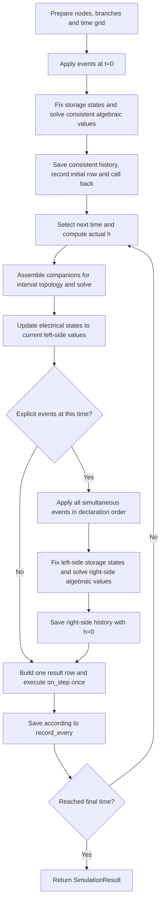

# Deriving component equations, discretization and MNA stamps

[简体中文](component_derivations.md) · [Running examples](../README.md) · [Numerical conventions](numerical_conventions.en.md) · [Models and validation](models_and_validation.en.md)

This guide answers three questions: where a component's differential/algebraic equations come from, how they enter the matrix for the current step, and how the solution supplies history for the next step.
The derivations follow the repository implementation. [Models and validation](models_and_validation.en.md) remains the reference for parameters, validation results and applicability; the [integrated example](three_terminal_vsc_hvdc.en.md) documents the three-terminal system's sources and control settings.

## 1. Distinguish the nodal admittance matrix from the full MNA matrix

### 1.1 Unknowns, units and directions

Let N be the number of non-reference nodes and M the number of permanent branch-current unknowns. The program solves:

$$
x=\begin{bmatrix}v\\j\end{bmatrix},\qquad
\underbrace{\begin{bmatrix}Y&B\\F&D\end{bmatrix}}_{A}
\begin{bmatrix}v\\j\end{bmatrix}
=\begin{bmatrix}b_v\\b_j\end{bmatrix}=b.
$$

`matrix` is the full A; only its upper-left block Y is the nodal admittance block. The first N rows impose KCL; the remaining rows impose branch constraints for voltage sources, inductors, transformers and similar devices.
Coefficients in Y primarily have units of S; other blocks may contain dimensionless incidence coefficients, resistances or turns ratios. Entries throughout A cannot all be interpreted as siemens.
We name the lower-left block F to avoid confusion with capacitance C. With transformers or coupled ports, do not assume F=Bᵀ, D=0, or a symmetric positive-definite A.
For background on standard MNA blocks, see the [Qucs technical description](https://qucs.sourceforge.net/tech/node14.html); the matrices below are reconstructed from this project's source code.

For a two-terminal component directed from p to n, define incidence vector a with +1 at p, −1 at n and zero elsewhere. Omit the reference-node entry.

$$u=a^T v=V_p-V_n,\qquad i>0:\ p\rightarrow n.$$

The branch then contributes ai to nodal KCL. Contributions at shared nodes must accumulate; do not replace `+=` or `-=` with assignment.
SI units are s, V, A, Ω, H and F. The time-domain admittances here are real discrete equivalents, not power-frequency complex admittances inserted into an instantaneous network.

### 1.2 How indices map into arrays

[Circuit._prepare](../pycy_emt_lite/core/circuit.py) first traverses every `nodes()`, then every `register()`.
[NodeManager](../pycy_emt_lite/core/nodes.py) numbers non-reference nodes in first-appearance order and returns `None` for ground.
[VariableManager](../pycy_emt_lite/core/variables.py) assigns relative branch index q; the actual matrix index is `k=context.branch_offset+q=N+q`.
Internal nodes and delta-winding nodes must also be declared by `nodes()` before the matrix is created.

| Model | Permanent additional current unknowns | Main history or dynamic quantities |
|---|---:|---|
| `Resistor`, `CurrentSource` | 0 | No energy-storage history |
| `VoltageSource` | 1 | No energy-storage history; its value can vary with time |
| `Capacitor` | 0 | Previous terminal voltage and current |
| `Inductor` | 1 | Previous current and voltage |
| `ThreePhaseSource` | 3 | Current samples of the three sources |
| `ThreePhaseLine`, `ThreePhaseLoad` | 3 when L>0, otherwise 0 | Per-phase current and pure-inductor voltage |
| `ThreePhaseParallelRLCLoad` | 3 with inductive branches, otherwise 0 | Per-phase L/C history |
| `PiLine`, `ThreePhasePiLine` | 1 / 3 when L>0, otherwise 0 | Series L and two C/2 histories |
| `SegmentedLine` | Number of segments when L>0, otherwise 0 | Independent L/C history per segment |
| `BergeronLine`, `ThreePhaseBergeronLine` | 0 | Delayed terminal voltage/current sequences |
| `SinglePhaseTransformer` | 2, or 3 with magnetization | Leakage, magnetizing history and flux linkage |
| `ThreePhaseTransformer` | 6, or 9 with magnetization | Independent transformer states per phase |
| `Fault`, `Breaker`, `IdealSwitch` | 0 | Conduction state and current outputs; no inherent energy storage |
| `SynchronousMachine` | 3 internal EMF sources; 3 more when Ls>0 | Rotor angle, speed and stator RL history |
| `ParkSynchronousGenerator` | 3 internal EMF sources + 3 algebraic stator currents | Angle, speed, two transient EMFs, excitation and mechanical power |

Consistent initialization/event solves temporarily add capacitor-current unknowns, as explained in Section 13; they do not change the permanent numbering above.
Filter compositions and controller connections are covered in Sections 11 and 12.

## 2. Static basic components: deriving stamps directly from KCL

Source: [basic.py](../pycy_emt_lite/components/basic.py); shared helpers: [stamping.py](../pycy_emt_lite/core/stamping.py).

### 2.1 Resistor

Ohm's law gives i=u/R=gu, where g=1/R. Substituting into the nodal contribution ai gives:

$$\Delta Y=g aa^T,\qquad \Delta b_v=0.$$

When both p and n are non-reference nodes, the local table is:

$$
\Delta A_{\{p,n\},\{p,n\}}=
\begin{bmatrix}g&-g\\-g&g\end{bmatrix}.
$$

These are exactly the four additions in `add_conductance()`. With n grounded, only `A[p,p]+=g` remains.
R has no integration state; `outputs()` reads u from the current solution and computes i=u/R. Positive ui is absorbed power and equals Ri².

### 2.2 CurrentSource

I(t) is known. Move the KCL term aI to the right-hand side:

$$\Delta Y=0,\qquad \Delta b_v=-aI(t_k).$$

Thus `b[p]-=I` and `b[n]+=I`. To inject positive current into node p, orient the source from ground to p.
No unknown current or energy-storage update is needed; `stamp()` reads the constant or callable value at tₖ on every step.
`CurrentSource` currently does not override `outputs()`, so results do not automatically include `i:<source_name>`; the source value is already a known input.
Its analytic `derivative` is used only when a relevant consistency constraint requires di/dt.

### 2.3 VoltageSource

u=E(t) is known, but the current depends on the surrounding network and cannot be represented by a finite conductance. Introduce branch current jₖ:

$$a j_k\ \text{enters nodal KCL},\qquad a^T v=E(t).$$

For local unknowns `[Vp,Vn,jk]`:

$$
\Delta A=\begin{bmatrix}0&0&1\\0&0&-1\\1&-1&0\end{bmatrix},\qquad
\Delta b=\begin{bmatrix}0\\0\\E(t)\end{bmatrix}.
$$

`register()` allocates the current index, `stamp()` writes the nodal column and voltage-constraint row, and `outputs()` reads the current from the solution.
jk is often negative when the source delivers power; E·jk is absorbed power under the passive sign convention. Derivative information is used only for the instantaneous consistency solve in Section 13, not ordinary positive-time steps.

## 3. Capacitor: deriving a conductance and a history current source

Starting with charge q=Cu and i=dq/dt, constant C gives i=C du/dt.
Let h=tₖ−tₖ₋₁>0. Subscript 0 denotes the known left endpoint of this interval and subscript 1 the unknown right endpoint.

### 3.1 Trapezoidal derivation

$$u_1-u_0=\frac{h}{2C}(i_1+i_0).$$

Solving for the current at this step:

$$i_1=\frac{2C}{h}u_1-\frac{2C}{h}u_0-i_0=G_Cu_1+H_C,$$

$$G_C=2C/h,\qquad H_C=-G_Cu_0-i_0.$$

G_C is a numerical equivalent conductance and H_C a history current source; the physical capacitor has not acquired an extra loss resistor.

### 3.2 Backward Euler derivation

$$i_1=C\frac{u_1-u_0}{h}=G_Cu_1+H_C,\qquad G_C=C/h,\quad H_C=-G_Cu_0.$$

Both methods have the same stamp structure, with different coefficients and history sources:

$$\Delta Y=G_Caa^T,\qquad \Delta b_v=-aH_C.$$

For example, a grounded capacitor contributes `A[p,p]+=GC` and `b[p]-=HC`. With positive initial charge voltage, HC is often negative and the right-hand-side injection can be positive.
This agrees exactly with the sign in `add_current_source(rhs,p,n,history_current)`.

### 3.3 Why update order matters

`Capacitor.stamp()` calls `_companion()`, reads `previous_voltage/current`, and only constructs the current equation.
After solving x₁, `update_state()` first obtains u₁=aᵀv₁, then calculates i₁=G_Cu₁+H_C using the **old history, still intact**.
Only then does it save `previous_voltage=u1`, `previous_current=i1` and `last_current=i1`.
Replacing u₀ with u₁ before evaluating the history source would incorrectly cancel charging current.
G_C is recalculated at the next step; an inserted event point may change h, so the preceding conductance cannot simply be reused.

Initialization does not assign a tiny h: the `_initial` branch only registers C and its declared voltage, while the consistent network determines its current.
A capacitor in parallel with an ideal time-varying voltage source generally has nonzero initial current.

## 4. Inductor and series RL: why an inductor needs a row

### 4.1 From flux-linkage integration to a branch constraint

For a linear inductor, flux linkage λ=Li and terminal voltage u=dλ/dt=L di/dt.
Trapezoidal integration gives:

$$i_1-i_0=\frac{h}{2L}(u_1+u_0),$$

$$u_1-R_Li_1=H_L,\qquad R_L=2L/h,\quad H_L=-R_Li_0-u_0.$$

Backward Euler gives:

$$u_1-R_Li_1=H_L,\qquad R_L=L/h,\quad H_L=-R_Li_0.$$

This project retains i₁ as an MNA branch unknown. Its local contribution for `[Vp,Vn,i1]` is:

$$
\Delta A=\begin{bmatrix}0&0&1\\0&0&-1\\1&-1&-R_L\end{bmatrix},\qquad
\Delta b=\begin{bmatrix}0\\0\\H_L\end{bmatrix}.
$$

The nodal rows encode current incidence; the last row is the discrete inductor equation.
`Inductor.update_state()` reads the branch current directly, calculates the terminal voltage, and saves `previous_current/previous_voltage`.

Eliminating the branch current would yield the Norton form `i=u/RL−HL/RL`: add aaᵀ/RL to Y and aHL/RL to the right-hand side.
The two formulations are mathematically equivalent; **the current standalone Inductor implementation uses the augmented branch form above**, without also adding this Norton conductance.
Adding both forms would count the same component twice.
For background on EMT history-source equivalents, see [PSCAD's lumped RLC description](https://www.pscad.com/webhelp-pscad-v5.1.0-ol/EMTDC/Electric_Network_Solution/representation_of_lumped_rlc_elements.htm).

### 4.2 Series RL history must retain the pure-inductor voltage

In line, load and stator branches, terminal voltage u=Ri+uL, hence:

$$a^Tv_1-(R+R_L)i_1=H_L.$$

The nodal incidence entries stay unchanged, while the branch diagonal becomes `−(R+RL)`. After solving, save `uL1=u1−R i1` for the next trapezoidal history term.
Using total terminal voltage u₁ as uL₁ would include the resistive drop again in the history.
These compositions allow L=0 with R>0: no inductor current is registered and conductance 1/R is stamped directly. R=0 with L>0 is also allowed, but both cannot be zero.

## 5. A complete RLC circuit: assemble, solve, update and solve again

### 5.1 Circuit and indexing

```text
       R=1 ohm       L=1 H
 s o---/\/\/---o a---coil---o b
   |                         |
 Vs=1 V                    C=1 F
   |                         |
  ground-----------------ground
```

Inductor current flows a→b and capacitor voltage is Vb. Set `iL(0)=0.1 A`, `vC(0)=0.2 V` and h=0.1 s.
With the component order in the code below, node indices are s=0, a=1 and b=2; source-current index is 3 and inductor-current index is 4.

$$x=[V_s,V_a,V_b,i_{Vs},i_L]^T.$$

The consistent initial solution is `[1,0.9,0.2,−0.1,0.1]`, with uL(0)=0.7 V and iC(0)=0.1 A.
The latter two quantities are not independently declared storage states, but they are required history for the first trapezoidal step.

### 5.2 Assembly row by row

Let g=1/R. The positive-time-step equations are:

$$
\begin{bmatrix}
g&-g&0&1&0\\
-g&g&0&0&1\\
0&0&G_C&0&-1\\
1&0&0&0&0\\
0&1&-1&0&-R_L
\end{bmatrix}
\begin{bmatrix}V_s\\V_a\\V_b\\i_{Vs}\\i_L\end{bmatrix}
=\begin{bmatrix}0\\0\\-H_C\\1\\H_L\end{bmatrix}.
$$

The five rows are KCL at s, a and b, the source-voltage constraint, and the discrete inductor constraint.
The `−iL` term at b indicates current entering that node; `GC Vb+HC` is capacitor current flowing to ground.

| First positive-step parameter | Trapezoidal | Backward Euler |
|---|---:|---:|
| g / S | 1 | 1 |
| G_C / S | 20 | 10 |
| H_C / A | −4.1 | −2.0 |
| R_L / Ω | 20 | 10 |
| H_L / V | −2.7 | −1.0 |

Solving the matrix and then updating history as in Sections 3 and 4 gives:

| Method | t / s | Va / V | Vb=vC / V | iL=iC / A | uL / V |
|---|---:|---:|---:|---:|---:|
| Shared initial state | 0 | 0.900000000000 | 0.200000000000 | 0.100000000000 | 0.700000000000 |
| Trapezoidal | 0.1 | 0.833966745843 | 0.213301662708 | 0.166033254157 | 0.620665083135 |
| Trapezoidal | 0.2 | 0.775784948178 | 0.232814078007 | 0.224215051822 | 0.542970870171 |
| Backward Euler | 0.1 | 0.837837837838 | 0.216216216216 | 0.162162162162 | 0.621621621622 |
| Backward Euler | 0.2 | 0.783296810324 | 0.237886535184 | 0.216703189676 | 0.545410275140 |

For example, the second trapezoidal step uses `HC=−20×0.213301662708−0.166033254157` and
`HL=−20×0.166033254157−0.620665083135`; it cannot keep the first-step values −4.1 A and −2.7 V.

### 5.3 Runnable code to inspect the assembled matrix

The existing `solver` interface can record the actual assembled matrices without modifying the library. The initial consistency system temporarily contains capacitor current,
so `systems[0]` is 6×6; `systems[1]` is the first positive-step 5×5 matrix above.

```python
import numpy as np
from pycy_emt_lite import (
    Capacitor, Circuit, Inductor, Resistor, SimulationConfig, Simulator, VoltageSource,
)
from pycy_emt_lite.core.solvers import DenseLinearSolver

class RecordingSolver(DenseLinearSolver):
    def __init__(self):
        super().__init__()
        self.systems = []

    def solve(self, matrix, rhs):
        self.systems.append((matrix.copy(), rhs.copy()))
        return super().solve(matrix, rhs)

for method in ("trapezoidal", "backward_euler"):
    components = (
        VoltageSource("Vs", "s", "0", 1.0),
        Resistor("R", "s", "a", 1.0),
        Inductor("L", "a", "b", 1.0, initial_current=0.1),
        Capacitor("C", "b", "0", 1.0, initial_voltage=0.2),
    )
    circuit = Circuit.from_components("rlc_derivation", components)
    solver = RecordingSolver()
    result = Simulator(circuit, SimulationConfig(0.1, 0.2, method=method), solver=solver).run()
    gc, rl, hc, hl = (20, 20, -4.1, -2.7) if method == "trapezoidal" else (10, 10, -2, -1)
    expected_a = np.array([
        [1, -1, 0, 1, 0], [-1, 1, 0, 0, 1], [0, 0, gc, 0, -1],
        [1, 0, 0, 0, 0], [0, 1, -1, 0, -rl],
    ], dtype=float)
    expected_b = np.array([0, 0, -hc, 1, hl], dtype=float)
    np.testing.assert_allclose(solver.systems[1][0], expected_a)
    np.testing.assert_allclose(solver.systems[1][1], expected_b)
    row = result.rows[1]
    actual = [row[k] for k in ("v:s", "v:a", "v:b", "i:Vs", "i:L")]
    np.testing.assert_allclose(actual, np.linalg.solve(expected_a, expected_b))
    print(method, row)
```

This is an instructional check covering two positive steps; large simulations should not retain a complete matrix at every step. Recording matrices here only exposes the existing solution process.

## 6. Three-phase sources, lines and loads: combining three phase equations

Source: [three_phase.py](../pycy_emt_lite/components/three_phase.py). Three phases are three separate instantaneous node voltages, not one complex phasor unknown.
External connections, neutral nodes and other components can couple phases; the components in this section have no internal mutual-inductance matrix.

### 6.1 ThreePhaseSource

With phase-voltage RMS U, phase offsets are φa=φ₀, φb=φ₀−2π/3 and φc=φ₀+2π/3:

$$e_\alpha(t)=\sqrt2 U\sin(2\pi ft+\phi_\alpha),\qquad \alpha\in\{a,b,c\}.$$

Each phase port is `terminal_bus:phase → neutral`; apply the voltage-source stamp from Section 2.3 to each port.
Each of the three branch currents occupies a column/row. An ungrounded common neutral also has its own KCL row.
The input is phase-voltage RMS: divide line-voltage RMS by √3 first. Sources are sampled at the current t; the analytic derivative for consistent initialization is `sqrt(2) U 2πf cos(2πft+φ)`.
`outputs()` reads the three source branch currents directly; there is no separate integration process.

### 6.2 ThreePhaseLine

Each phase points from `from_bus:phase` to `to_bus:phase` and satisfies:

$$u_\alpha=R i_\alpha+L\dot i_\alpha.$$

For L>0, each phase contributes the augmented series-RL block from Section 4.2. Phase histories are stored separately in `state.previous_current[phase]` and `previous_inductor_voltage[phase]`.
For L=0, each phase reduces to a four-entry conductance stamp, without a branch-current unknown. `last_voltage` is the total line drop; the trapezoidal history retains `u−Ri` instead.
This model has no shunt capacitance and is not a Pi line; R/L are total per-phase values.

### 6.3 ThreePhaseLoad

Replacing the receiving end of each preceding RL branch with a shared `neutral` produces a star-connected RL load.
The phase equations, stamps and updates are identical, with positive current directed from bus to neutral.
If the neutral is a non-reference node, KCL determines its voltage; it must not be arbitrarily reset to zero in post-processing.
This is a series-RL load, without a constant-power control law accepting P/Q or a built-in delta connection.

### 6.4 ThreePhaseParallelRLCLoad

Here P, QL and QC are **total three-phase powers** at nominal voltage, used to calculate fixed per-phase parameters.
Let nominal line voltage be ULL, phase voltage Uφ=ULL/√3, and ω=2πf. Balanced sinusoidal power relationships give:

$$P=3U_\phi^2G_R,\qquad Q_L=\frac{3U_\phi^2}{\omega L},\qquad Q_C=3\omega C U_\phi^2,$$

$$G_R=\frac{P}{U_{LL}^2},\quad L=\frac{U_{LL}^2}{\omega Q_L},\quad C=\frac{Q_C}{\omega U_{LL}^2}.$$

A zero power term omits its branch rather than dividing by zero. QL/QC are nonnegative magnitudes; net absorbed reactive power is QL−QC.
For each phase, R, L and C connect in parallel between phase node and neutral, and their stamps add:

$$\Delta Y=(G_R+G_C)aa^T,\quad \Delta b_v=-aH_C,$$

If L exists, also add `a iL` to KCL and the branch row `aᵀv−RL iL=HL`.
After solving, compute `i_total=GR u+iL+iC`. L and C update their own histories; total current is not stored as either inductor or capacitor current.
Initial L/C states are zero and are handled by the instantaneous consistency solve. Without an active-power branch, parameter output `r:<name>:phase=inf` indicates the absent branch, not a divergent network solution.
Power varies with operating voltage according to fixed impedance; there is no constant-P/Q nonlinear iteration.

## 7. Pi and segmented lines: terminal current versus series current

Source: [lines.py](../pycy_emt_lite/components/lines.py). Shared `_stamp_series_rl` and `_stamp_shunt_capacitor` helpers implement Sections 4 and 3, respectively.

### 7.1 PiLine

For per-unit-length parameters R′, L′, C′ and length ℓ, first set R=R′ℓ, L=L′ℓ and C=C′ℓ.
The Pi approximation lumps total series impedance between the ends and distributes total capacitance equally between each end and the reference terminal, C/2 at each end.

```text
 sending o------ R,L ------o receiving
         |                 |
        C/2               C/2
         |                 |
       ground------------ground
```

The code takes these total parameters directly without another length multiplication. With a grounded reference, L>0 and C>0, the stamp for local unknowns `[Vs,Vr,i]` is:

$$
\Delta A=\begin{bmatrix}G_s&0&1\\0&G_r&-1\\1&-1&-(R+R_L)\end{bmatrix},\qquad
\Delta b=\begin{bmatrix}-H_s\\-H_r\\H_L\end{bmatrix}.
$$

The two capacitances have equal parameters but independent Hs/Hr histories because terminal voltages differ. For an ungrounded reference terminal, include its corresponding incidence rows and columns.
For L=0, replace the final row/column with a two-terminal 1/R conductance; for C=0, omit both capacitors.

After solving, save series i and pure-inductor drop `Vs−Vr−Ri`, and compute/store the two capacitor currents separately.
Output `i:<name>:series` is series current directed from sending to receiving.
If both terminal currents are defined as **entering the line**:

$$i_{send}=i+i_{Cs},\qquad i_{recv}=-i+i_{Cr}.$$

Terminal power is therefore `Vs i_send+Vr i_recv`; using the same series current at both ends would omit shunt storage.

### 7.2 ThreePhasePiLine

Replicate the preceding Pi unit for a/b/c, sharing parameter values but not history states.
R, L and C remain total **per-phase** parameters; C is not divided by 3 again. Incidence changes with phase endpoints and entries accumulate in the global arrays.
For L>0, register three series currents. Each phase also has two C/2 histories. There is no interphase mutual inductance/capacitance or modal transformation.

### 7.3 SegmentedLine

With N segments, each takes R/N, L/N and C/N, with C/(2N) at either end; introduce N−1 internal nodes.
Stamping each Pi unit adds the two adjacent half-capacitances at an internal node to C/N.
The outer endpoints retain C/(2N), so total line capacitance is C. Assigning C/N at all N+1 nodes would be incorrect.
The global matrix naturally connects adjacent nodes. With L>0, each segment has one current unknown and separately updated history.

`i:<name>:sending/receiving` record series currents in the first/last segments, both directed from sending to receiving;
`average` is the arithmetic mean of the segment series currents. None is a complete terminal current including endpoint capacitance.
Segmentation improves spatial resolution while introducing more storage states. Reducing h only improves time discretization and cannot replace increasing the segment count.

## 8. Bergeron traveling-wave lines: the remote end enters through history sources

### 8.1 Deriving delay relations from the lossless telegrapher equations

For a uniform lossless line, spatial coordinate ξ increases from sending to receiving:

$$\frac{\partial v}{\partial\xi}=-L'\frac{\partial i}{\partial t},\qquad
\frac{\partial i}{\partial\xi}=-C'\frac{\partial v}{\partial t}.$$

Define Z₀=√(L′/C′), propagation speed c=1/√(L′C′), and delay τ=ℓ/c for length ℓ.
The equations describe two quantities, v+Z₀i and v−Z₀i, traveling along characteristics.
Receiving-end current ir is defined as entering the line from the receiving node, opposite to the positive spatial direction. The terminal relations are therefore:

$$v_s(t)-Z_0i_s(t)=v_r(t-\tau)+Z_0i_r(t-\tau),$$
$$v_r(t)-Z_0i_r(t)=v_s(t-\tau)+Z_0i_s(t-\tau).$$

Rearranging gives a Norton equivalent at each port:

$$i_s(t)=v_s(t)/Z_0+H_s(t),\quad H_s=-v_r(t-\tau)/Z_0-i_r(t-\tau),$$
$$i_r(t)=v_r(t)/Z_0+H_r(t),\quad H_r=-v_s(t-\tau)/Z_0-i_s(t-\tau).$$

This explains both minus signs in `BergeronLine.stamp()`. See the [PSCAD Bergeron description](https://www.pscad.com/webhelp-v5-ol/EMTDC/Transmission_Lines/The_Bergeron_Model.htm) for background; this project implements only the teaching approximation declared here.

### 8.2 Current-step stamps and delay-history updates

At each port, independently write `Y+=aaᵀ/Z0` and `bv−=aH`, without registering a branch-current unknown.
With a grounded reference terminal, this component contributes no sending-to-receiving off-diagonal entry to the current Y; the remote-end effect is already in the **delayed** H.
Both ends still participate in one global solve. This does not mean the program automatically performs parallel simulation.

After solving, compute port current with `i=v/Z0+H`, then store both terminal voltages and currents at this time for retrieval τ later.
The implementation requires τ=d·h, where d is an integer of at least 1; the read index is `round(t/h)−d`.
Negative-time history is fixed at zero, so the remote history source is zero before wave arrival. There is no fractional-delay interpolation; events must also lie on the fixed grid.
An explicit event update at the same time replaces the last history row with the right-side value instead of inserting an extra sample.

`attenuation=η` multiplies both H terms by η, with 0<η≤1; η=1 recovers the lossless relations above.
η<1 approximates propagation-amplitude attenuation. It is neither fitted from specified frequency-dependent R′/L′/C′/G′ nor another representation of a Pi-line resistor.
`ThreePhaseBergeronLine` owns one `BergeronLine` per phase and calls the same stamp/update logic on each, without interphase coupling.

## 9. Transformers: combining ratio constraints, leakage and magnetization

Source: [transformers.py](../pycy_emt_lite/components/transformers.py). Both `SinglePhaseTransformer` and the three-phase wrapper call `_stamp_transformer_phase()`.

### 9.1 Identify the actual equivalent circuit first

Let nT=Np/Ns>0. Define up/us from each winding's positive to negative terminal, and ip/is as entering each positive terminal.
Ideal magnetic coupling gives `up=nT us` and, by power conservation, `ip=−is/nT`.
Adding primary-referred series leakage impedance gives the main power-transfer branch equations:

$$u_p-n_Tu_s=R_\sigma i_p+L_\sigma\dot i_p,\qquad n_Ti_p+i_s=0.$$

In this implementation, magnetizing inductance Lm and core-loss resistance Rfe are **in parallel across the external primary port**. Their voltage is up, not `up−Rσ ip−Lσ dip/dt`.
This placement determines storage and output-current interpretations; port-power formulas from a different equivalent circuit cannot be applied unchanged.

### 9.2 Full local block for the main power-transfer branch

Let ap/as be the primary/secondary port incidence vectors. Unknowns are `[v,ip,is]`, where v contains all node voltages.
Discretize leakage inductance as in Section 4 and set Zσ=Rσ+RLσ:

$$
\Delta A=
\begin{bmatrix}
0&a_p&a_s\\
a_p^T-n_Ta_s^T&-Z_\sigma&0\\
0&n_T&1
\end{bmatrix},\qquad
\Delta b=\begin{bmatrix}0\\H_{L\sigma}\\0\end{bmatrix}.
$$

The first block row is KCL for both ports, the second is the leakage/ratio voltage relation, and the third is the ideal coupling's ampere-turn relation.
This explains why the source writes voltage coefficients in the `primary_branch` row but `nT ip+is=0` in the `secondary_branch` row.
ip and is remain separate unknowns even with zero leakage inductance. With entirely zero leakage impedance, the second row becomes the ideal voltage-ratio constraint.
A row indexed by branch current is therefore not necessarily an ordinary impedance equation.

Magnetizing inductance adds variable im, nodal column ap and constraint `apᵀv−RLm im=HLm`.
Core loss adds `ap apᵀ/Rfe` directly to Y. Neither enters the main transfer relation `nT ip+is=0`.

### 9.3 Quantities retained after the solve

`_update_transformer_phase()` saves:

$$i_{\sigma,0}\leftarrow i_p,\quad u_{L\sigma,0}\leftarrow u_p-n_Tu_s-R_\sigma i_p,$$
$$i_{m,0}\leftarrow i_m,\qquad u_{m,0}\leftarrow u_p.$$

Flux linkage integrates `dλm/dt=up`: trapezoidal gives `λm1=λm0+h(up0+up1)/2`, while backward Euler gives `λm1=λm0+h up1`.
Consistent initialization/event-right solves have h=0 and do not advance flux linkage again.
`i:<name>:primary` reports only ip; the **total primary input current** is `ip+im+up/Rfe`, with absent-branch terms set to zero.
`secondary` reports is, usually negative when supplying a load. Three-phase outputs also require distinguishing winding currents from line currents.

With linear parameters and total port currents:

$$p_{in}=u_p(i_p+i_m+u_p/R_{fe})+u_si_s
=R_\sigma i_p^2+u_p^2/R_{fe}+\frac{d}{dt}\left(\frac{L_\sigma i_p^2+L_m i_m^2}{2}\right).$$

In the ideal limit, secondary load Rload referred to the primary is nT²Rload, obtained by eliminating is and us from the two ratio relations above.

### 9.4 ThreePhaseTransformer: Y/delta changes the incidence vectors

Each phase uses the complete preceding block, with independent leakage/magnetizing states. `_winding_port()` selects ports:

| Connection | Winding a | Winding b | Winding c |
|---|---|---|---|
| Y | a→neutral | b→neutral | c→neutral |
| D | a→b | b→c | c→a |

Connections produce line/phase voltage conversion and phase shift; no empirical extra 30° phase-shift source is added.
For example, delta-side line current is `Ia=Iab−Ica`. With primary magnetization/core loss, first include each winding's total current before taking that difference.
`turns_ratio` is the winding-voltage ratio. Line-voltage ratio is nT for identical connections, √3nT for Y/delta, and nT/√3 for delta/Y.
For example, a zero-leakage delta/Y transformer with 100 V primary line voltage and nT=2 has secondary line voltage 100√3/2 V.
A delta secondary with zero leakage impedance leaves winding circulating current non-unique and is explicitly rejected at construction; a pseudoinverse must not silently choose that current.
Grounding a Y connection depends on the neutral node and external wiring; there are no magnetic-coupling equations for a shared three-limb core.

### 9.5 What the saturation option actually does

The source selects the current-step inductance from the preceding flux linkage:

$$L_{eff}=\begin{cases}L_m,&|\lambda_{m,0}|<\lambda_{knee},\\L_{sat},&|\lambda_{m,0}|\ge\lambda_{knee}.\end{cases}$$

It then substitutes Leff into an ordinary inductor companion and updates flux linkage from up after solving.
There is no current-step Newton iteration for nonlinear `i=f(λ)` and no full magnetization-curve reprojection of flux/current across the switch.
Consequently, the linear energy formula above is not a strict saturation-energy identity across an inductance change.
This is an explicitly lagged two-region inductance approximation. Independent saturation-energy, hysteresis and inrush validation remains incomplete.

## 10. Synchronous machines: mechanical states affect the next electrical stamp

### 10.1 The common swing equation

Both machines define current from internal EMF to terminal, so positive terminal power means generation delivered outward, unlike the absorption convention for ordinary two-terminal elements.
Let per-unit speed w=ωm/ωm,b and inertia constant H=Jωm,b²/(2Sbase). Rotational kinetic energy is Ekin=H Sbase w².
Equating mechanical input minus electromagnetic output to the kinetic-energy rate gives:

$$2H S_{base}w\dot w=P_m-P_{em}-D S_{base}(w-1),$$
$$\dot w=\frac{P_m/S_{base}-P_{em}/S_{base}-D(w-1)}{2Hw},\qquad
\dot\delta=\omega_b(w-1).$$

δ is electrical rotor angle relative to the synchronous frame; actual electrical angle is θ=ωbt+δ. The implementation retains w in the denominator and must not be described as the constant-2H approximation.
Explicit Euler evaluates all derivatives using w, power and controls from the **same left endpoint**, without mixing old and new speed within a step.

### 10.2 SynchronousMachine: internal EMF sources and stator RL

Source: [synchronous.py](../pycy_emt_lite/machines/synchronous.py). Each internal phase EMF is:

$$e_\alpha(t)=\sqrt2 E_{rms}\sin(\omega_bt+\delta+\phi_\alpha),\qquad
e_\alpha-v_\alpha=R_si_\alpha+L_s\dot i_\alpha.$$

The actual circuit contains three internal nodes, three voltage sources connected to neutral, and three RL branches from internal nodes to machine terminals.
Voltage sources use Section 2.3's block; stator RL uses Section 4.2's block. For L>0 there are six branch-current unknowns; for L=0 the stator branches stamp conductances only.

The actual execution order is:

1. On entering `stamp()` for a positive-time step, if `context.time>state.time`, update δ/w using Pm, Pem and w retained from the preceding solution, and save the new state time.
2. Compute eabc using updated δ and current t, write the three source right-hand sides, and construct RL companions from old stator electrical history.
3. After the network solve, `update_state()` saves i and `uLs=e−v−Rs i`, then computes `Pterminal=Σvi`, `Pcopper=RsΣi²` and `Pem=Σei`.
4. Read and save the constant/callable mechanical power at the current time for use over the next positive-time interval.

Thus `Pem−Pterminal=Pcopper+d(ΣLs i²/2)/dt`; terminal active power alone is insufficient feedback for the swing equation.
Stator RL uses the globally selected trapezoidal/backward Euler method, while mechanical δ/w always use explicit Euler. The whole electromechanical coupling does not thereby become second order.
At zero time, declared δ/w are retained; stator-inductor currents start at zero and consistent voltages are solved. Event-right h=0 does not update δ/w again.
When electrical initial constraints need it, the internal sinusoidal source provides `de/dt=sqrt(2) Erms ωb w cos(θ+φ)`.

### 10.3 ParkSynchronousGenerator: reduced dq equations to algebraic abc ports

Source: [park_generator.py](../pycy_emt_lite/machines/park_generator.py). This reduced transient-EMF model
retains rotor transient-EMF dynamics but neglects fast stator flux derivatives, describing the port using power-frequency dq reactance relations.
Its stator-current unknowns are therefore algebraic, **not inductor states**. Replacing X′/ω with independent stamped inductors would change the model.

Using phase-voltage RMS base Ub and three-phase power base Sb:

$$Z_b=3U_b^2/S_b,\quad V_{pk,b}=\sqrt2 U_b,\quad I_{pk,b}=\sqrt2 S_b/(3U_b).$$

The machine-axis orientation in the code is d=−cosθ, q=sinθ. Let the three rows of M be `[-cos(θ+φα), sin(θ+φα)]`. In the zero-sequence-free subspace:

$$v_{abc}=M v_{dq},\qquad v_{dq}=\tfrac23 M^Tv_{abc},\qquad M^TM=\tfrac32 I_2.$$

Both outputs of the project's generic `abc_to_dq()` are negated, then divided by their respective peak bases, to obtain machine Vd/Vq and Id/Iq. Negating only the q axis is incorrect.
The per-unit port equations are:

$$V_d=E_d'-R_sI_d+X_q'I_q,\qquad V_q=E_q'-R_sI_q-X_d'I_d.$$

Rearrange as an E−V/current relation and transform through M into physical abc quantities:

$$X=\begin{bmatrix}0&-X_q'\\X_d'&0\end{bmatrix},\quad
Z_{abc}=R_{s,\Omega}I_3+Z_bMX\left(\tfrac23M^T\right),$$
$$e_{abc}=V_{pk,b}M\begin{bmatrix}E_d'\\E_q'\end{bmatrix},\qquad
e_{abc}-v_{abc}=Z_{abc}i_{abc}.$$

Resistance uses I₃ to retain all three phase components; X acts only on the dq subspace. The zero-sequence port therefore contains only stator resistance, without a complete zero-sequence flux model.
Zabc generally contains off-diagonal terms expressing transformed cross-coupling; dropping them and stamping three independent impedances would be incorrect.

### 10.4 MNA rows and columns for the Park port

Create internal nodes and three voltage-source currents for the phase EMFs, and register three further algebraic stator currents jₐ, jᵦ and j𝚌.
Let aα point from internal node to terminal. Nodal KCL receives Σaαjα, and branch row α is:

$$a_\alpha^Tv-\sum_{\beta\in\{a,b,c\}}Z_{abc,\alpha\beta}j_\beta=0.$$

The source implements this with `matrix[branch, branches] -= impedance[index]`, writing this phase's coefficients for **all three phase currents** together.
The three internal sources separately put eabc in their constraint right-hand sides. There is no stator `RL`/`HL` history; with current θ/E′ known, the system is still linear.
Eliminating internal ideal-source nodes would give `vterminal+Zabc i=eabc`. The code retains those internal nodes; the two formulations must not be added simultaneously.

### 10.5 Transient EMFs, AVR and governor: model assumptions and updates

The implementation starts from the following first-order rotor transient-EMF equations. They are reduced winding-model parameter equations;
the source does not derive X′/T′ individually from a full winding-inductance matrix, field winding and damper windings.
At open circuit, Id=Iq=0: Eq′ relaxes toward Efd with Tdo′ and Ed′ decays with Tqo′. Load currents affect the states through X−X′ coupling:

$$T_{do}'\dot E_q'=E_{fd}-E_q'-(X_d-X_d')I_d,$$
$$T_{qo}'\dot E_d'=-E_d'+(X_q-X_q')I_q.$$

The first-order AVR defines target excitation `Efd,target=Efd,initial+KA(Vref−Vt)`, giving the lag equation:

$$T_A\dot E_{fd}=E_{fd,initial}+K_A(V_{ref}-V_t)-E_{fd},\quad V_t=\sqrt{V_d^2+V_q^2}.$$

The governor target follows static droop, `Pm,target=Pm,ref−(w−1)/Rdroop`:

$$T_g\dot P_m=P_{m,ref}-(w-1)/R_{droop}-P_m.$$

Here E, I, X and Pm are per unit on the bases above; time constants are seconds.
Together with δ/w from Section 10.1, there are six dynamic states. The source computes derivatives from all old values, then applies `z1=z0+h f(z0,measurements0)`.
Updated Efd and Pm are clipped to their own limits; this is not the control package's integral-freezing PI anti-windup.

At a positive-time step, `stamp()` first calls `_update_controls_and_machine(h)`, then constructs the port using new θ/E′.
`update_state()` only extracts current abc/dq measurements, terminal power and copper loss for the next step, without integrating the six states again.
With fast stator storage neglected, feedback is `Pem=Pterminal+Pcopper`. Under balanced conditions, the port equations give:

$$P_{em}/S_b=E_d'I_d+E_q'I_q+(X_q'-X_d')I_dI_q.$$

The last term is the saliency/reluctance contribution and cannot be omitted when the two axis reactances differ.
At t=0/event-right, dynamic states are retained but algebraic stator currents may jump; inductor-current continuity must not be imposed on them.
The model neither computes load-flow initial conditions automatically nor supports additional ideal constraints requiring analytic derivatives of internal transient EMFs; such a structure raises an explicit error.

## 11. L, LC, LCL and the integrated example's filter networks

Source: [converters/filters.py](../pycy_emt_lite/converters/filters.py). The three helper classes return existing R/L/C elements from `.components()`;
they have no own `stamp()`, integration state or solver. Expanded internal nodes participate in global numbering like ordinary component nodes.

### 11.1 LFilter

`input → Rs → L → output`, with positive current from input to output, satisfies `L di/dt=vin−vout−Rs i`.
For Rs>0, an intermediate node is created and resistor/inductor are stamped separately; for Rs=0, both resistor and intermediate node are omitted.
This is equivalent to a combined series-RL branch equation, but the actual expansion retains two elements and their individual voltage relations.

### 11.2 LCFilter

Add C from the LFilter output to ground. With output resistance Rload:

$$L\dot i=v_{in}-R_si-v_C,\qquad C\dot v_C=i-v_C/R_{load}.$$

The first equation comes from series KVL and the second from output-node KCL. MNA does not directly call this two-state ODE; it adds the component stamps from Sections 2–4.
The same solved node voltages and inductor current naturally satisfy these two discretized equations.

### 11.3 LCLFilter: damping R is in series with the capacitor

```text
 converter -- R1,L1 -- m -- R2,L2 -- grid
                       |
                      Rd
                       |
                       c
                       |
                       C
                       |
                     ground
```

i1 flows converter→m, i2 flows m→grid, and ic flows from m through Rd/C to ground.
KCL at m and the Rd voltage drop give `ic=i1−i2` and `vm=vc+Rd ic`, hence:

$$L_1\dot i_1=v_{conv}-R_1i_1-v_m,\quad
L_2\dot i_2=v_m-R_2i_2-v_{grid},\quad C\dot v_C=i_1-i_2.$$

The code stamps each R/L/C separately. With Rd>0, the capacitor's upper terminal is internal node `name:damping`, not m.
With Rd=0, c and m are the same node; the series resistor is omitted, not the capacitor.
Inductor currents and capacitor voltage default to zero and the basic components update their histories; the composition does not keep duplicate states.

### 11.4 High-pass filters, DC lines and snubbers in the integrated example

Each phase high-pass filter in [Example 18](../examples/18_three_terminal_vsc_hvdc.py) is `LV → C → f`, with R and L from f to ground in parallel.
Thus `iC=iR+iL` and `uC=VLV−Vf`; the capacitor voltage is not VLV to ground.
For `[VLV,Vf,iL]`, the local block is:

$$\Delta A=\begin{bmatrix}G_C&-G_C&0\\-G_C&G_C+1/R&1\\0&1&-R_L\end{bmatrix},\quad
\Delta b=\begin{bmatrix}-H_C\\H_C\\H_L\end{bmatrix}.$$

Each bipolar DC T-line combines `R,L → midpoint shunt C → R,L`, adding individual stamps through midpoint KCL.
Positive and negative poles are modeled separately. Split DC capacitors connect each pole to ground; they must not be described as two parallel pole-to-pole capacitors.
The fault-clearing series-RC snubber is likewise separate R and C elements: only parameters and wiring differ, with no special solver branch.

## 12. How switches, controllers and PWM change the electrical equations

### 12.1 Fault, Breaker and IdealSwitch

Sources: [switching.py](../pycy_emt_lite/components/switching.py), [power_electronics.py](../pycy_emt_lite/components/power_electronics.py).
All three use `i=g u`, so `ΔY=g aaᵀ` with no additional current unknown:

| Component | On-state g | Off-state g | State source |
|---|---|---|---|
| `Fault` | 1/Rfault | 0 | `enabled`, changed by fault events |
| `Breaker` | 1/Rclosed | 0 | `closed`, changed by breaker events |
| `IdealSwitch` | 1/Rclosed | `open_conductance` | Constant or gate callable at the current time |

A is assembled from zero each step, so opening only needs to omit conductance; there is no need to manually subtract it from the preceding matrix.
`update_state()` computes i from the current state and voltage. `last_current/last_state` are measurement/logic records, not L/C energy storage.
`IdealSwitch.stamp()` samples and saves `last_state`; `update_state()` uses that same state for current, avoiding inconsistent repeated gate evaluations.
Finite Ron produces resistive loss `p=g u²`; this is not a zero-drop semiconductor and has no separate diode, junction-capacitance or switching-loss model.

### 12.2 Control blocks do not occupy MNA rows or columns

Blocks in [blocks.py](../pycy_emt_lite/controls/blocks.py) receive sampled inputs and return digital commands; they are not `Component` objects.
Let control sampling interval be hc, using the actual difference between successive sample times.

| Block | Continuous/algebraic starting point | Discrete update in the code |
|---|---|---|
| `Limiter` | Bound u between lower/upper limits | `y=min(max(u,lower),upper)`, with no dynamic state |
| `PIController` | `dxi/dt=Ki e`, `u=Kp e+xi` | Candidate `xi*=xi0+Ki e1 hc`, `u*=Kp e1+xi*`, then clipping |
| `FirstOrderLowPass` | `tau dy/dt=u−y` | Backward Euler: `y1=(y0+hc u1/tau)/(1+hc/tau)` |
| `SampleDelay` | Delay by d calls in sample order | Pop the front and enqueue the input; d=0 passes the current input through |

PI output uses the clipped candidate u*. The candidate integral is not saved if the raw output exceeds the upper limit with e>0, or falls below the lower limit with e<0; otherwise it is saved.
This is the source's actual freeze condition. It is not back-calculation anti-windup, and does not imply that final output always equals `Kp e+saved xi`.
`SampleDelay` delays by call count; changing hc does not automatically preserve a fixed delay in seconds.
These blocks require a positive sampling interval. At t=0, observe/initialize directly instead of calling `step()` with zero interval.

### 12.3 abc/dq transforms and the SRFPLL error

[transforms.py](../pycy_emt_lite/controls/transforms.py) uses amplitude-invariant transforms:

$$\begin{bmatrix}v_\alpha\\v_\beta\end{bmatrix}
=\frac23\begin{bmatrix}1&-1/2&-1/2\\0&\sqrt3/2&-\sqrt3/2\end{bmatrix}v_{abc},$$
$$\begin{bmatrix}v_d\\v_q\end{bmatrix}
=\begin{bmatrix}\cos\theta&\sin\theta\\-\sin\theta&\cos\theta\end{bmatrix}
\begin{bmatrix}v_\alpha\\v_\beta\end{bmatrix}.$$

The inverse uses the two matrices' inverse on the zero-sequence-free subspace, giving `a=alpha`, `b=−alpha/2+sqrt(3) beta/2` and `c=−alpha/2−sqrt(3) beta/2`.
The zero-sequence component `(a+b+c)/3` of arbitrary abc inputs is not retained by this two-axis transform.
For balanced voltage of amplitude V and true space-vector angle θg, `vq=V sin(θg−θ)`. Positive vq indicates a lagging estimated angle, so increasing angular frequency through PI reduces the angle error.

[SRFPLL](../pycy_emt_lite/controls/pll.py) executes:

$$\theta_1=wrap(\theta_0+\omega_0h_c),\quad
e_1=\frac{v_q(t_1,\theta_1)}{\max(|v_d|,|v_q|,1\ {\rm V})},\quad
\omega_1=\omega_{nom}+PI(e_1).$$

Advance the angle to the **current voltage sample time** before evaluating phase error; ω₁ is used for the next interval.
`frequency` is in rad/s. Absolute frequency limits are reduced by ωnom before being passed to the internal PI's correction limits.
The PLL does not stamp Y. It changes the coordinate angle used by later control, eventually affecting next-step source/switch parameters through commands.

### 12.4 From VSCController and PWM to the six-switch bridge

Sources: [vsc.py](../pycy_emt_lite/controls/vsc.py), [pwm.py](../pycy_emt_lite/controls/pwm.py).
The station reactor current is positive from AC to converter, with abc equation `L di/dt=vg−vc`.
Differentiating the rotating transform gives `d(Ti)/dt=T di/dt+(dT/dt)i`, hence:

$$L\dot i_d=v_{gd}-v_{cd}+\omega L i_q,\qquad
L\dot i_q=v_{gq}-v_{cq}-\omega L i_d.$$

Define current errors ed=Id*−Id and eq=Iq*−Iq. PI should create positive `L di/dt`, giving the negative-PI voltage commands used in the code:

$$v_{cd}^*=v_{gd}+\omega L i_q-PI(e_d),\qquad
v_{cq}^*=v_{gq}-\omega L i_d-PI(e_q).$$

The Vdc outer loop follows capacitor energy `E=Ceq Vdc²/2`: low Vdc requires more absorbed AC power, so the Vdc-error PI produces positive Id*.
At a power-controlled station with vq≈0, `P≈1.5 vd id` gives `Id*=P*/(1.5 vd)`. The code adds a voltage floor and current limits; this expression is not a complete constant-power algebraic constraint.
Under this example's sign convention, `Q=1.5(vq id−vd iq)`. Positive Iq supplies capacitive reactive power to the grid, so low Vac makes the Vac PI request positive Iq*.
See the integrated example guide for the actual circular current-reference limit, dq voltage-vector limit, and integral freezing under downstream saturation.

Inverse-transform the voltage command and divide by measured Vdc/2 to obtain modulation mabc. If φ=frac(t fsw), the triangular carrier is:

$$c(t)=\begin{cases}4\phi-1,&\phi<1/2,\\3-4\phi,&\phi\ge1/2.\end{cases}$$

`carrier_compare(m,c)` returns 1 when m≥c. The upper switch has gate=g and the lower gate=1−g, with no dead time.
`sine_pwm_duty(m,theta)=(1+m sin(theta))/2` is only a duty-cycle helper and does not directly apply average network voltage.

For one phase leg, use node order `[DC+,phase,DC−]` and upper/lower conductances gt/gb:

$$\Delta Y=\begin{bmatrix}g_t&-g_t&0\\-g_t&g_t+g_b&-g_b\\0&-g_b&g_b\end{bmatrix},\qquad \Delta b_v=0.$$

These three rows show how PWM changes MNA: it changes two actual switch conductances, rather than merely adding a gate waveform to the result file.
Repeat this block for three phases, giving six switches per station and eighteen in the three-terminal system, solved together with AC reactors and DC capacitors.
`on_step` updates modulation after the current network solve; gate callables read the held value at the next stamp.
There is no extra control callback between event-left and event-right solves; sampled PWM edges are not automatically converted to precisely located events.

## 13. Initial and event-right states: no fictitious tiny integration step

### 13.1 Why declaring vC and iL is insufficient

Capacitor voltage and inductor current are energy-storage states; capacitor current and inductor voltage are determined by the instantaneous network.
TR history sources need both sets. Arbitrarily assigning zero to unsolved iC(0)/uL(0) can produce an incorrect first step even when declared vC(0)/iL(0) are correct.
Initialization is neither an assumed AC steady state nor a single tiny-h integration. It solves instantaneous constraints with storage states fixed.
Sources are [_InitialConditions in stamping.py](../pycy_emt_lite/core/stamping.py) and [Simulator._solve_step](../pycy_emt_lite/core/simulation.py).

In a consistency-solve context, components register storage constraints and the assembler applies:

| Element | Constraint for this solve | Quantity still to determine |
|---|---|---|
| C | Temporarily add current jC for each C, with KCL column a and constraint row `aᵀv=vC0` | jC, subsequently saved as iC0 |
| L | Keep the existing current unknown and KCL column; replace the branch row with `jL=iL0` | uL0, from terminal voltage minus resistive drop |
| R, independent sources, ideal ratio | Retain current-time algebraic relations | Voltages/currents solved jointly with storage constraints |

In Section 5's circuit, the permanent vector has 5 entries; adding temporary iC at t=0 makes 6.
The solution is `Va=0.9 V`, `Vb=0.2 V`, `iC=0.1 A`, hence `uL=0.7 V`.
Temporary unknowns are removed after the consistency solve, but their values are retained first for capacitor `update_state()` to read.

### 13.2 Dependent constraints do not necessarily mean no physical solution

Parallel capacitors may have redundant voltage constraints; an inductor cutset may lose the equation that determines a node voltage once currents are fixed.
A singular frozen A₀ therefore does not by itself justify rejecting the circuit, nor should a pseudoinverse arbitrarily distribute current.
The code normalizes rows by their largest absolute coefficient, uses column-pivoted QR on A₀ᵀ to select independent equations, and constructs dependency relations W with `W A₀=0`.

If `W b₀` is nonzero beyond tolerance, storage initial conditions already conflict with KCL/KVL, as when ideal capacitors with different initial voltages are directly paralleled.
That requires an impulse or changed initial states and is rejected by this project.

For compatible original constraints, the continuous component equations provide a first-derivative relation:

$$A_0\dot x=D_0x+d_0.$$

D₀ here is the initialization derivative coefficient matrix, not Section 1's MNA branch block D.
Differentiating a capacitor constraint gives `aᵀ dv/dt=jC/C`; an inductor's fixed-current row gives
`djL/dt=(u−RjL)/L`, with actual winding-voltage difference used for transformer leakage.
Voltage-source constraints and current-source KCL derivatives use analytic source derivatives.
Multiplying by W eliminates derivative unknowns and produces the extra **algebraic equations**:

$$W D_0x=-W d_0.$$

The program retains independent original rows and completes a square matrix with these derivative constraints. It explicitly rejects a system that remains underdetermined after one differentiation.
This is not a general arbitrary-index DAE solver; it neither differentiates repeatedly to higher orders nor allocates quantities by least squares.

Three small examples explain the added equations physically:

1. Equal-voltage C₁/C₂ in parallel are supplied by current I. KCL gives `i1+i2=I`; equal voltage derivatives give `i1/C1=i2/C2`, hence `i1=C1 I/(C1+C2)`.
2. A capacitor parallels ideal source E(t). The voltage constraint sets vC=E and its derivative sets `iC=C dE/dt`; instantaneous E alone cannot determine iC.
3. Three identical inductors have outer-terminal voltages 400, 0 and 0 V and connect at a floating star point, with all initial currents zero. Differentiating star-point KCL gives `Σ(ek−vN)/L=0`, hence `vN=400/3 V`, not 0 V.

A source's `derivative` is called only if that source actually participates in a dependent constraint requiring differentiation.
Constant-source derivatives are zero and three-phase sinusoidal sources provide analytic derivatives. Ordinary finite-impedance connections usually do not require user-supplied derivatives.
A Park internal EMF in an ideal constraint that requires its derivative currently raises an unsupported-structure error; an estimated finite difference must not be described as implemented behavior.

### 13.3 The solution must still satisfy the original constraints

After the completed equations are solved, `accept()` checks every original frozen-equation row:

$$|(A_0x-b_0)_r|\le 10^{-12}+10^{-10}\bigl((|A_0||x|)_r+|b_{0,r}|\bigr).$$

If LU rounding causes a row to fail, `_solve_step()` performs just one more solve of the completed system's residual equation, `A δx=b−Ax`, applies `x←x+δx`, and repeats the same original-constraint check.
This single iterative-refinement correction does not relax tolerances or repair physically incompatible initial conditions.
Finally, h=0 `update_state()` saves consistent iC/uL without advancing vC, iL, mechanical states or flux linkage.

## 14. The complete EMT loop: rebuilding matrices and applying states

### 14.1 From a case to one network solve

`CaseDefinition → run_case → Circuit → Simulator` is the existing entry path; no second model-compilation process is needed.
After node/permanent-branch indices are prepared once, `_assemble()` creates zero A/b on every solve and calls every component's `stamp(context,A,b)`.
Local current contributions automatically accumulate at shared nodes to form global KCL; voltage constraints appear in their branch rows.

The default [DenseLinearSolver](../pycy_emt_lite/core/solvers.py) uses pivoted dense LU, without explicitly forming an inverse.
It checks finiteness of A/b/x, absolute residual `||Ax−b||∞`, and a scaled relative residual.
Rejection occurs only if **both** residuals exceed their respective tolerances; initialization additionally checks rows as in Section 13.
These checks assess algebraic solution accuracy, not physical model correctness or whether the time step is small enough.

### 14.2 Actual order with and without events



On an ordinary step, L/C history comes from the preceding accepted time. On an event step, integration first reaches t⁻ using pre-event switch states.
After all simultaneous events are applied in declaration order, solve the right side while holding `vC(t⁺)=vC(t⁻)` and `iL(t⁺)=iL(t⁻)`.
iC and uL can jump, and their new right-side values must enter the next TR history sources.
The event itself consumes no integration interval. Each time has only one result row; an event row represents t⁺.
If the new topology forces an instantaneous storage-state change, the consistency solve fails instead of suddenly emptying a capacitor or forcing inductor current to zero.

`insert` adds explicit event times to the grid, with companions using actual adjacent-point h;
`quantize_up` delays to the first grid point not earlier than the requested time; `require_aligned` rejects off-grid events.
Current `stop_time` must be an integer multiple of the base step. Bergeron additionally requires a fixed actual grid and positive integer-step delay.
Callable source/gate discontinuities are not automatically located through the event queue. Sample-time resolution is not precise switching-time location.

### 14.3 Updates inside stamp versus after the solve

It is inaccurate to generalize that stamp never changes any state. Actual responsibilities are:

| Stage | R/L/C, lines and transformers | Machines, gates and control |
|---|---|---|
| `stamp()` | Build A/b from saved history and current h; do not overwrite L/C history early | Both machines explicitly advance internal states using previous measurements before writing current EMF/ports; switches sample/save gate states |
| Network LU solve | Obtain node voltages and all permanent branch currents together | Machine ports are part of the same system |
| `update_state()` | Recover iC/uL from this solution, write storage and line history; transformers integrate flux linkage | Machines update port measurements/powers for the next interval; switches recover current |
| `on_step()` | Read-only access to the current network result row | Controllers update commands using actual sampling intervals for next-step electrical stamps |

Machine time/step conditions prevent repeated advancement at h=0 initialization or event-right solves. This is still not an implicit machine/network Newton iteration.
For matrix inspection, use Section 5's recording solver instead of repeatedly calling a live machine's `stamp()` manually at future times, which may advance its internal states.
`on_step` returns new finite-real fields; it cannot overwrite existing network fields or mutate the current result row in place.

### 14.4 Why A sometimes changes and sometimes only b changes

A fixed-h linear RLC network with fixed parameters has constant companion coefficients, so A can remain unchanged while history sources change b every step.
Events that change conductances, inserted events that change h, saturation options changing effective L, and a Park machine's angle-dependent Zabc all change A; time-dependent sources also change b.
The current implementation fully rebuilds and refactorizes on every solve. Although the solver offers a reusable-factorization interface, the simulation loop has no automatic matrix cache or incremental factorization; a possible optimization is not an implemented feature.

`record_every` only reduces retained rows; integration, history updates and control callbacks still occur at every solution point.
t=0, final time and explicit event points are retained. Output spacing may differ from the simulation step, so analysis must read the actual `time` column.

## 15. Independently checking stamps and transient accuracy

### 15.1 Check signs using physics before relying on LU residuals

An incorrect current direction can still form an exactly solvable A. Check independent relations:

- Recalculate each node's KCL using **actual port directions**. Include shunt capacitors at Pi-line terminals and magnetization/core loss at transformer primary terminals.
- Substitute measured u/i into continuous model equations or independent analytic/phasor references. A transient cannot be checked solely against a steady-state phasor.
- Check initial vC/iL and matching iC/uL, then storage continuity and right-side algebraic quantities across events.
- Compare the same model with smaller h at shared time points. For segmented lines, separately check segment-count convergence; the two are different checks.

### 15.2 TR and BE have different discrete energy properties

Linear storage elements satisfy `EC=C u²/2` and `EL=L i²/2`. Define `ū=(u1+u0)/2` and `ī=(i1+i0)/2`.
Multiplying the TR equations in Sections 3/4 by the corresponding averages gives each ideal storage element's exact discrete relation:

$$E_{C,1}-E_{C,0}=h\bar u\bar i,\qquad E_{L,1}-E_{L,0}=h\bar u\bar i.$$

This is **average voltage times average current**, generally not the trapezoidal integral of endpoint power, `h(u1 i1+u0 i0)/2`.
It explains the TR energy property of linear lossless LC networks with fixed topology.

For BE, use `a(a−b)=(a²−b²+(a−b)²)/2` to obtain:

$$h u_1i_1=E_{C,1}-E_{C,0}+\tfrac12 C(u_1-u_0)^2,$$
$$h u_1i_1=E_{L,1}-E_{L,0}+\tfrac12 L(i_1-i_0)^2.$$

The nonnegative final term is discrete numerical dissipation, whereas `Ri²` is actual modeled resistor loss.
Do not interpret all BE numerical dissipation as line loss, or use these linear identities to prove exact overall energy conservation with saturation switching or explicit machine control.
With voltage-source current recorded in the absorption direction, outward supplied power is `−u i_source`.

### 15.3 Events and output decimation affect energy accounting

These stepwise identities use the endpoints of one integration interval with unchanged topology.
Event output retains only t⁺, omitting capacitor current or inductor voltage at the preceding interval's endpoint t⁻. Applying endpoint formulas across an event can therefore produce a spurious energy error.
Check continuous-topology intervals separately or obtain the needed left/right values in the validation calculation.

Two decimated rows may span many internal steps. Their output interval and differences cannot replace the single-step BE dissipation terms.
For stepwise energy checks, use `record_every=1` or accumulate required quantities in each step callback; checks needing event-left values must also retain the corresponding validation data.
See the [integrated example guide](three_terminal_vsc_hvdc.en.md) for Example 18's bridge-port power, DC discrete energy and current evidence boundaries.

## 16. Source and validation reading map

| Content in this guide | Implementation | Corresponding checks |
|---|---|---|
| Sections 1–5: indexing, RLC and basic sources | [basic.py](../pycy_emt_lite/components/basic.py), [stamping.py](../pycy_emt_lite/core/stamping.py) | [test_basic_components.py](../tests/test_basic_components.py) |
| Section 6: three-phase sources and loads | [three_phase.py](../pycy_emt_lite/components/three_phase.py) | [test_three_phase.py](../tests/test_three_phase.py) |
| Sections 7–8: Pi, segmented and traveling-wave lines | [lines.py](../pycy_emt_lite/components/lines.py) | [test_line_models.py](../tests/test_line_models.py) |
| Section 9: transformers | [transformers.py](../pycy_emt_lite/components/transformers.py) | [test_transformers.py](../tests/test_transformers.py) |
| Section 10: both machines | [synchronous.py](../pycy_emt_lite/machines/synchronous.py), [park_generator.py](../pycy_emt_lite/machines/park_generator.py) | [Classical machine tests](../tests/test_synchronous_machine.py), [Park machine tests](../tests/test_park_synchronous_generator.py) |
| Sections 11–12: filters, control and switches | [filters.py](../pycy_emt_lite/converters/filters.py), [controls](../pycy_emt_lite/controls), [power_electronics.py](../pycy_emt_lite/components/power_electronics.py) | [Control tests](../tests/test_controls.py), [Power-electronics tests](../tests/test_power_electronics.py) |
| Section 12: complete VSC control and circuit | [Example 18](../examples/18_three_terminal_vsc_hvdc.py), [vsc.py](../pycy_emt_lite/controls/vsc.py) | [System tests](../tests/test_three_terminal_vsc_hvdc.py) |
| Sections 13–15: initialization, events and main loop | [simulation.py](../pycy_emt_lite/core/simulation.py), [stamping.py](../pycy_emt_lite/core/stamping.py) | [Events](../tests/test_events.py), [Time grid](../tests/test_time_grid.py), [Step callback](../tests/test_step_callback.py) |

Start with Section 5's matrix example, then follow “component `stamp` → assembly → solve → `update_state` → next history source.”
This guide expands the derivations and reading path for the current implementation. [Models and validation](models_and_validation.en.md) remains authoritative on which independent checks have actually been completed for each model.
