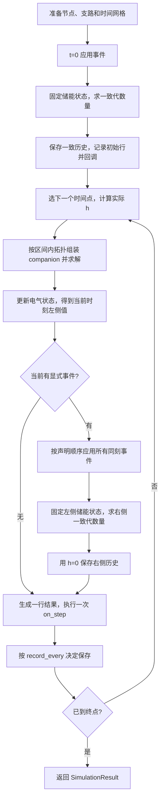

# 元件方程、离散化与 MNA 盖章推导

[English](component_derivations.en.md) · [运行入口](../README.zh-CN.md) · [数值约定](numerical_conventions.md) · [模型与验证](models_and_validation.md)

本文回答三个问题：元件的微分/代数方程从何而来，方程怎样写入当前时间步的矩阵，以及求解后怎样建立下一步的历史量。
推导对应仓库实际实现。模型参数、已有验证数值和适用范围仍由[模型与验证](models_and_validation.md)维护；三端系统的参考来源与控制定值见[综合示例](three_terminal_vsc_hvdc.md)。

## 1. 先区分节点导纳矩阵和完整 MNA 矩阵

### 1.1 未知量、单位和方向

设非参考节点数为 N，长期支路电流未知量数为 M。程序求解：

$$
x=\begin{bmatrix}v\\j\end{bmatrix},\qquad
\underbrace{\begin{bmatrix}Y&B\\F&D\end{bmatrix}}_{A}
\begin{bmatrix}v\\j\end{bmatrix}
=\begin{bmatrix}b_v\\b_j\end{bmatrix}=b.
$$

`matrix` 是完整 A，只有左上角 Y 是节点导纳块。上 N 行是 KCL；其余行是电压源、电感、变压器等的支路约束。
Y 的系数以 S 为主；其他块可能含无量纲关联系数、电阻或变比。不能把整个 A 的每个元素都解释为西门子。
这里把左下块写为 F，避免与电容 C 混淆；含变压器或耦合端口时，不应预设 F=Bᵀ、D=0 或 A 对称正定。
标准 MNA 分块的背景可参阅 [Qucs 技术说明](https://qucs.sourceforge.net/tech/node14.html)；下文矩阵按本项目源码重建。

对从 p 指向 n 的两端元件，定义关联向量 a：p 分量 +1，n 分量 −1，其余为 0。参考节点的分量省略。

$$u=a^T v=V_p-V_n,\qquad i>0:\ p\rightarrow n.$$

于是该支路在节点 KCL 中贡献 ai。相同节点的贡献必须累加；`+=`、`-=` 不能改成覆盖赋值。
SI 单位为 s、V、A、Ω、H、F；本例的时域导纳是实数离散等效参数，不是把工频复导纳直接代入瞬时网络。

### 1.2 编号如何进入数组

[Circuit._prepare](../pycy_emt_lite/core/circuit.py) 先遍历所有 `nodes()`，再遍历 `register()`。
[NodeManager](../pycy_emt_lite/core/nodes.py) 按首次出现顺序给非参考节点编号，参考地返回 `None`。
[VariableManager](../pycy_emt_lite/core/variables.py) 给支路分配相对编号 q；实际矩阵索引为 `k=context.branch_offset+q=N+q`。
内部节点、三角形绕组节点也必须先由 `nodes()` 声明，不能在矩阵已经创建后临时添加。

| 模型 | 长期额外电流未知量 | 主要历史或动态量 |
|---|---:|---|
| `Resistor`、`CurrentSource` | 0 | 无储能历史 |
| `VoltageSource` | 1 | 无储能历史；值可随时间变化 |
| `Capacitor` | 0 | 上一步端电压、电流 |
| `Inductor` | 1 | 上一步电流、电压 |
| `ThreePhaseSource` | 3 | 三个源的当前采样值 |
| `ThreePhaseLine`、`ThreePhaseLoad` | L>0 时 3，否则 0 | 每相电流、纯电感压降 |
| `ThreePhaseParallelRLCLoad` | 有感性支路时 3，否则 0 | 每相 L/C 历史 |
| `PiLine`、`ThreePhasePiLine` | L>0 时 1 / 3，否则 0 | 串联 L、两端 C/2 历史 |
| `SegmentedLine` | L>0 时为段数，否则 0 | 每段独立的 L/C 历史 |
| `BergeronLine`、`ThreePhaseBergeronLine` | 0 | 两端延时电压、电流序列 |
| `SinglePhaseTransformer` | 2，含励磁时 3 | 漏感、励磁历史及磁链 |
| `ThreePhaseTransformer` | 6，含励磁时 9 | 每相独立变压器状态 |
| `Fault`、`Breaker`、`IdealSwitch` | 0 | 导通状态及当前输出；无自身储能 |
| `SynchronousMachine` | 3 个内电势源；Ls>0 时另加 3 | 转角、转速、定子 RL 历史 |
| `ParkSynchronousGenerator` | 3 个内电势源 + 3 个代数定子电流 | 转角、转速、两轴暂态电势、励磁、机械功率 |

电容在一致初值/事件求解时临时增加电流未知量，见第 13 节；它不改变上述长期编号。
滤波器组合和控制器的接入方式分别见第 11、12 节。

## 2. 静态基础元件：从 KCL 直接得到盖章

源码：[basic.py](../pycy_emt_lite/components/basic.py)，共用函数：[stamping.py](../pycy_emt_lite/core/stamping.py)。

### 2.1 Resistor：电阻

欧姆定律 i=u/R=gu，其中 g=1/R。代入节点贡献 ai，得到：

$$\Delta Y=g aa^T,\qquad \Delta b_v=0.$$

p、n 均为非参考节点时的局部表为：

$$
\Delta A_{\{p,n\},\{p,n\}}=
\begin{bmatrix}g&-g\\-g&g\end{bmatrix}.
$$

这正是 `add_conductance()` 的四项写入。n 接地时只剩 `A[p,p]+=g`。
R 不保存积分状态；`outputs()` 从本步解读取 u，再计算 i=u/R。正的 ui 是吸收功率，等于 Ri²。

### 2.2 CurrentSource：独立电流源

I(t) 已知，KCL 中原有项 aI 移到右侧：

$$\Delta Y=0,\qquad \Delta b_v=-aI(t_k).$$

因此 `b[p]-=I`、`b[n]+=I`。若要向节点 p 注入正电流，源方向应为地→p。
无需引入未知电流，也没有储能更新；`stamp()` 每步读取常量或 callable 在 tₖ 的值。
当前 `CurrentSource` 没有单独覆盖 `outputs()`，结果不自动含 `i:<源名>`；源值本身是已知输入。
解析导数 `derivative` 只在一致求解的相关约束需要 di/dt 时使用。

### 2.3 VoltageSource：独立电压源

u=E(t) 已知，电流却取决于外部网络，不能用有限电导表达。增加支路电流 jₖ：

$$a j_k\ \text{进入节点 KCL},\qquad a^T v=E(t).$$

在局部未知量 `[Vp,Vn,jk]` 上：

$$
\Delta A=\begin{bmatrix}0&0&1\\0&0&-1\\1&-1&0\end{bmatrix},\qquad
\Delta b=\begin{bmatrix}0\\0\\E(t)\end{bmatrix}.
$$

`register()` 分配电流编号，`stamp()` 写入节点列和电压约束行，`outputs()` 读取解中的电流。
源供电时 jk 常为负；E·jk 是按被动方向定义的吸收功率。求导信息不进入普通正时间步，只供第 13 节的瞬时一致求解使用。

## 3. Capacitor：电容如何变为电导和历史电流源

从电荷 q=Cu 和 i=dq/dt 出发，对常值 C 有 i=C du/dt。
令 h=tₖ−tₖ₋₁>0，下标 0 表示本积分区间左端已知值，下标 1 表示待求右端。

### 3.1 梯形积分推导

$$u_1-u_0=\frac{h}{2C}(i_1+i_0).$$

解出本步未知电流：

$$i_1=\frac{2C}{h}u_1-\frac{2C}{h}u_0-i_0=G_Cu_1+H_C,$$

$$G_C=2C/h,\qquad H_C=-G_Cu_0-i_0.$$

G_C 是数值等效电导，H_C 是历史电流源；并不意味着实际电容多出了一个损耗电阻。

### 3.2 后向欧拉推导

$$i_1=C\frac{u_1-u_0}{h}=G_Cu_1+H_C,\qquad G_C=C/h,\quad H_C=-G_Cu_0.$$

两种方法具有相同的盖章形式，只是系数和历史源不同：

$$\Delta Y=G_Caa^T,\qquad \Delta b_v=-aH_C.$$

例如接地电容有 `A[p,p]+=GC`、`b[p]-=HC`；初充电压为正时 HC 常为负，因此右端注入可能为正。
这与 `add_current_source(rhs,p,n,history_current)` 的符号完全一致。

### 3.3 为什么更新顺序重要

`Capacitor.stamp()` 调用 `_companion()`，读取 `previous_voltage/current`，仅形成当步方程。
求出 x₁ 后，`update_state()` 先算 u₁=aᵀv₁，再用**尚未覆盖的旧历史**算 i₁=G_Cu₁+H_C。
最后才保存 `previous_voltage=u1`、`previous_current=i1`、`last_current=i1`。
若先把旧 u₀ 改为 u₁再计算历史源，就会错误抵消本步充电电流。
到下一步重新计算 G_C；有事件插点时不能沿用上一个 h 的电导。

初值不是给 h 一个极小数：`_initial` 分支只登记 C 与已声明电压，电流由一致网络求出。
电容并联理想时变电压源时，初始电流一般不为零。

## 4. Inductor 与串联 RL：为什么电感占用一行

### 4.1 从磁链积分到支路约束

线性电感磁链 λ=Li，端电压 u=dλ/dt=L di/dt。
梯形积分给出：

$$i_1-i_0=\frac{h}{2L}(u_1+u_0),$$

$$u_1-R_Li_1=H_L,\qquad R_L=2L/h,\quad H_L=-R_Li_0-u_0.$$

后向欧拉给出：

$$u_1-R_Li_1=H_L,\qquad R_L=L/h,\quad H_L=-R_Li_0.$$

本项目保留 i₁ 为 MNA 支路未知量。对应 `[Vp,Vn,i1]` 的局部写入为：

$$
\Delta A=\begin{bmatrix}0&0&1\\0&0&-1\\1&-1&-R_L\end{bmatrix},\qquad
\Delta b=\begin{bmatrix}0\\0\\H_L\end{bmatrix}.
$$

节点行表示电流的关联关系，最后一行才是电感的离散物理方程。
`Inductor.update_state()` 直接读取支路电流，计算两端电压，再保存 `previous_current/previous_voltage`。

也可以消去支路电流得到 Norton 形式 `i=u/RL−HL/RL`，即 Y 增加 aaᵀ/RL、右端增加 aHL/RL。
两种形式数学等价；**当前独立 Inductor 实现采用上面的增广支路形式**，不在代码中另加这个 Norton 电导。
同时添加两种形式会重复计算同一个元件。
EMT 等效历史源的背景见 [PSCAD 的集中 RLC 说明](https://www.pscad.com/webhelp-pscad-v5.1.0-ol/EMTDC/Electric_Network_Solution/representation_of_lumped_rlc_elements.htm)。

### 4.2 串联 R–L 的历史必须保存纯电感电压

线路、负荷和定子支路中，端电压 u=Ri+uL，所以：

$$a^Tv_1-(R+R_L)i_1=H_L.$$

节点关联写入不变，支路对角变为 `−(R+RL)`。求解后保存 `uL1=u1−R i1`，再供下一步梯形历史使用。
如果把总端电压 u₁当成 uL₁，就会在历史项中重复加入电阻压降。
这些组合允许 L=0、R>0，此时不注册电感电流，直接盖章电导 1/R；允许 R=0、L>0，但不允许两者同时为零。

## 5. 一个完整 RLC 电路：手算矩阵、求解、更新再求解

### 5.1 电路与编号

```text
       R=1 ohm       L=1 H
 s o---/\/\/---o a---coil---o b
   |                         |
 Vs=1 V                    C=1 F
   |                         |
  ground-----------------ground
```

电感电流从 a→b，电容电压为 Vb。取 `iL(0)=0.1 A`、`vC(0)=0.2 V`，h=0.1 s。
按代码中元件顺序，节点索引为 s=0、a=1、b=2；源电流索引 3，电感电流索引 4。

$$x=[V_s,V_a,V_b,i_{Vs},i_L]^T.$$

初始一致解为 `[1,0.9,0.2,−0.1,0.1]`；同时有 uL(0)=0.7 V、iC(0)=0.1 A。
后两个量虽然不是独立指定的储能初值，却是梯形法第一步必须使用的历史。

### 5.2 逐行组装

令 g=1/R，则正时间步的方程为：

$$
\begin{bmatrix}
g&-g&0&1&0\\
-g&g&0&0&1\\
0&0&G_C&0&-1\\
1&0&0&0&0\\
0&1&-1&0&-R_L
\end{bmatrix}
\begin{bmatrix}V_s\\V_a\\V_b\\i_{Vs}\\i_L\end{bmatrix}
=\begin{bmatrix}0\\0\\-H_C\\1\\H_L\end{bmatrix}.
$$

五行分别为 s 节点 KCL、a 节点 KCL、b 节点 KCL、源电压约束和电感离散约束。
b 节点上的 `−iL` 表示电感电流流入该节点；`GC Vb+HC` 是流向地的电容电流。

| 第一正时间步参数 | 梯形法 | 后向欧拉 |
|---|---:|---:|
| g / S | 1 | 1 |
| G_C / S | 20 | 10 |
| H_C / A | −4.1 | −2.0 |
| R_L / Ω | 20 | 10 |
| H_L / V | −2.7 | −1.0 |

代入矩阵求解后，再按第 3、4 节更新历史，得到：

| 方法 | t / s | Va / V | Vb=vC / V | iL=iC / A | uL / V |
|---|---:|---:|---:|---:|---:|
| 共用初值 | 0 | 0.900000000000 | 0.200000000000 | 0.100000000000 | 0.700000000000 |
| 梯形法 | 0.1 | 0.833966745843 | 0.213301662708 | 0.166033254157 | 0.620665083135 |
| 梯形法 | 0.2 | 0.775784948178 | 0.232814078007 | 0.224215051822 | 0.542970870171 |
| 后向欧拉 | 0.1 | 0.837837837838 | 0.216216216216 | 0.162162162162 | 0.621621621622 |
| 后向欧拉 | 0.2 | 0.783296810324 | 0.237886535184 | 0.216703189676 | 0.545410275140 |

例如梯形第二步 `HC=−20×0.213301662708−0.166033254157`，
`HL=−20×0.166033254157−0.620665083135`；不能继续使用第一步的 −4.1 A、−2.7 V。

### 5.3 可运行的矩阵核对代码

下面使用已有 `solver` 接口记录真实装配矩阵，不修改库。初始一致系统临时包含电容电流，
所以 `systems[0]` 是 6×6 系统；`systems[1]` 才是上面的首个正时间步 5×5 矩阵。

```python
import numpy as np
from pycy_emt_lite import (
    Capacitor, Circuit, Inductor, Resistor, SimulationConfig, Simulator, VoltageSource,
)
from pycy_emt_lite.core.solvers import DenseLinearSolver

class RecordingSolver(DenseLinearSolver):
    def __init__(self):
        super().__init__()
        self.systems = []

    def solve(self, matrix, rhs):
        self.systems.append((matrix.copy(), rhs.copy()))
        return super().solve(matrix, rhs)

for method in ("trapezoidal", "backward_euler"):
    components = (
        VoltageSource("Vs", "s", "0", 1.0),
        Resistor("R", "s", "a", 1.0),
        Inductor("L", "a", "b", 1.0, initial_current=0.1),
        Capacitor("C", "b", "0", 1.0, initial_voltage=0.2),
    )
    circuit = Circuit.from_components("rlc_derivation", components)
    solver = RecordingSolver()
    result = Simulator(circuit, SimulationConfig(0.1, 0.2, method=method), solver=solver).run()
    gc, rl, hc, hl = (20, 20, -4.1, -2.7) if method == "trapezoidal" else (10, 10, -2, -1)
    expected_a = np.array([
        [1, -1, 0, 1, 0], [-1, 1, 0, 0, 1], [0, 0, gc, 0, -1],
        [1, 0, 0, 0, 0], [0, 1, -1, 0, -rl],
    ], dtype=float)
    expected_b = np.array([0, 0, -hc, 1, hl], dtype=float)
    np.testing.assert_allclose(solver.systems[1][0], expected_a)
    np.testing.assert_allclose(solver.systems[1][1], expected_b)
    row = result.rows[1]
    actual = [row[k] for k in ("v:s", "v:a", "v:b", "i:Vs", "i:L")]
    np.testing.assert_allclose(actual, np.linalg.solve(expected_a, expected_b))
    print(method, row)
```

这是两次正时间步的教学核对；大规模仿真不应保存每步完整矩阵。矩阵记录只用于理解现有求解流程。

## 6. 三相源、线路和负荷：三份单相方程怎样组合

源码：[three_phase.py](../pycy_emt_lite/components/three_phase.py)。三相不是一个复数相量未知量，而是三个独立的瞬时节点电压。
各相可以通过外部接线、中性点和其他元件发生耦合；本节元件内部没有相间互感矩阵。

### 6.1 ThreePhaseSource

相电压 RMS 为 U，相位偏置分别为 φa=φ₀、φb=φ₀−2π/3、φc=φ₀+2π/3：

$$e_\alpha(t)=\sqrt2 U\sin(2\pi ft+\phi_\alpha),\qquad \alpha\in\{a,b,c\}.$$

每相端口为 `terminal_bus:phase → neutral`，对每个端口应用第 2.3 节电压源盖章。
三个支路电流各占一列/行；公共中性点若不接地，也有自己的 KCL 行。
传入的是相电压 RMS，线电压 RMS 应先除以 √3。采样在当前 t；一致初值需要的解析导数为 `sqrt(2) U 2πf cos(2πft+φ)`。
`outputs()` 直接读取三相源支路电流，没有另一个积分过程。

### 6.2 ThreePhaseLine

每相从 `from_bus:phase` 指向 `to_bus:phase`，满足：

$$u_\alpha=R i_\alpha+L\dot i_\alpha.$$

L>0 时，每相按第 4.2 节写入一个串联 RL 增广块。三相状态分别存储在 `state.previous_current[phase]` 和 `previous_inductor_voltage[phase]`。
L=0 时每相退化为四项电导盖章，不注册支路电流。`last_voltage` 是线路总压降；保存进梯形历史的却是 `u−Ri`。
本模型没有并联电容，不能把它当作 π 型线；R/L 参数均为每相的总值。

### 6.3 ThreePhaseLoad

把上一节 RL 支路的接收端改成公共 `neutral`，就得到星形 RL 负荷。
每相的方程、盖章与更新完全相同，电流正方向为母线→中性点。
若中性点为非参考节点，KCL 会求其电压；不能在后处理中擅自把它设成零。
它是串联 RL 负荷，不接受 P/Q 后保持恒功率的控制律，也没有内置 Δ 接法。

### 6.4 ThreePhaseParallelRLCLoad

这里 P、QL、QC 是额定电压下的**三相总功率**，用于换算每相固定参数。
令额定线电压 ULL、相电压 Uφ=ULL/√3、ω=2πf。由平衡正弦功率关系：

$$P=3U_\phi^2G_R,\qquad Q_L=\frac{3U_\phi^2}{\omega L},\qquad Q_C=3\omega C U_\phi^2,$$

$$G_R=\frac{P}{U_{LL}^2},\quad L=\frac{U_{LL}^2}{\omega Q_L},\quad C=\frac{Q_C}{\omega U_{LL}^2}.$$

某项功率为零时省略对应支路，不对零功率做除法。QL/QC 分别以非负幅值输入，净吸收无功为 QL−QC。
每相由 R、L、C 三支路并联在相节点与 neutral 之间，盖章相加：

$$\Delta Y=(G_R+G_C)aa^T,\quad \Delta b_v=-aH_C,$$

此外，若 L 存在，再加 `a iL` 到 KCL 及 `aᵀv−RL iL=HL` 支路行。
求解后计算 `i_total=GR u+iL+iC`；L、C 各用各自历史更新，不把总电流保存为电感或电容电流。
初始各 L/C 状态为零，瞬时一致求解处理它们；无有功支路时参数输出 `r:<name>:phase=inf` 表示支路缺省，不是网络解发散。
运行电压变化时功率随固定阻抗而变化，程序没有恒 P/Q 的非线性迭代。

## 7. π 型与分段线路：为什么端口电流不等于串联电流

源码：[lines.py](../pycy_emt_lite/components/lines.py)。公共 `_stamp_series_rl`、`_stamp_shunt_capacitor` 分别复用第 4、3 节。

### 7.1 PiLine

若线路单位长度参数为 R′、L′、C′，长度为 ℓ，先取 R=R′ℓ、L=L′ℓ、C=C′ℓ。
π 近似将总串联阻抗集中在两端之间，总电容平均分配到两端对参考端，各为 C/2。

```text
 sending o------ R,L ------o receiving
         |                 |
        C/2               C/2
         |                 |
       ground------------ground
```

代码直接接收上述总参数，不额外乘长度。对接地参考、L>0、C>0，局部未知量 `[Vs,Vr,i]` 的盖章为：

$$
\Delta A=\begin{bmatrix}G_s&0&1\\0&G_r&-1\\1&-1&-(R+R_L)\end{bmatrix},\qquad
\Delta b=\begin{bmatrix}-H_s\\-H_r\\H_L\end{bmatrix}.
$$

两端电容参数相同但历史 Hs/Hr 独立，因为端电压不同。参考端不是地时，对它补上相应关联行列。
若 L=0，用两端 1/R 电导代替最后一行/列；若 C=0，省略两端电容。

求解后保存串联 i、纯电感压降 `Vs−Vr−Ri`，分别计算并保存两端电容电流。
输出 `i:<name>:series` 是从 sending→receiving 的串联电流。
若两端电流都定义为**流入线路**：

$$i_{send}=i+i_{Cs},\qquad i_{recv}=-i+i_{Cr}.$$

所以端口功率应使用 `Vs i_send+Vr i_recv`，不能只用两端电压乘同一个串联电流后忽略并联储能。

### 7.2 ThreePhasePiLine

对 a/b/c 各复制上一节 π 单元，共享参数数值但不共享历史状态。
R、L、C 仍是**每相**总参数，不把 C 再除以 3。节点关联随各相端点变化，矩阵条目在全局数组中相加。
L>0 时注册三个串联电流；每相另有两份 C/2 历史。它没有相间互电感/互电容或模态变换。

### 7.3 SegmentedLine

N 段时，每段取 R/N、L/N、C/N，两端各 C/(2N)，并引入 N−1 个内部节点。
逐段调用 π 单元盖章，所以相邻段的两个半电容在同一内部节点上相加为 C/N。
端点仍各为 C/(2N)，整条线路的电容总和为 C，不能把所有 N+1 个节点都放 C/N。
全局矩阵自然形成局部相邻节点连接；L>0 时每段一个电流未知量，历史分别更新。

`i:<name>:sending/receiving` 记录首段/末段串联电流，两者方向均沿 sending→receiving；
`average` 是这些串联电流的算术平均。这些字段都**不是**加上端点电容后的完整端口电流。
分段提高空间分辨率，同时引入更多储能状态；缩小 h 只改善时间离散误差，不能替代增加分段数。

## 8. Bergeron 行波线路：对端如何通过历史源进入矩阵

### 8.1 从无损电报方程得到延时关系

对均匀无损线，空间坐标 ξ 沿 sending→receiving：

$$\frac{\partial v}{\partial\xi}=-L'\frac{\partial i}{\partial t},\qquad
\frac{\partial i}{\partial\xi}=-C'\frac{\partial v}{\partial t}.$$

令 Z₀=√(L′/C′)、传播速度 c=1/√(L′C′)，长度 ℓ 的时延 τ=ℓ/c。
方程可写成两个沿特征线传播的量 v+Z₀i 与 v−Z₀i。
注意接收端电流 ir 定义为从接收节点流入线路，方向与空间正方向相反；两端关系因此为：

$$v_s(t)-Z_0i_s(t)=v_r(t-\tau)+Z_0i_r(t-\tau),$$
$$v_r(t)-Z_0i_r(t)=v_s(t-\tau)+Z_0i_s(t-\tau).$$

重新整理得到两个端口的 Norton 形式：

$$i_s(t)=v_s(t)/Z_0+H_s(t),\quad H_s=-v_r(t-\tau)/Z_0-i_r(t-\tau),$$
$$i_r(t)=v_r(t)/Z_0+H_r(t),\quad H_r=-v_s(t-\tau)/Z_0-i_s(t-\tau).$$

这就是 `BergeronLine.stamp()` 中两个负号的来源。背景参见 [PSCAD Bergeron 说明](https://www.pscad.com/webhelp-v5-ol/EMTDC/Transmission_Lines/The_Bergeron_Model.htm)；本项目仅实现此处声明的教学近似。

### 8.2 当步盖章与延时更新

对每一端口分别写入 `Y+=aaᵀ/Z0`、`bv−=aH`，不注册支路电流未知量。
如果参考端为地，本元件在当步 Y 中没有 sending 与 receiving 之间的非对角项；对端作用已经包含在**延迟**的 H 中。
两端仍参加同一个全局求解，不能据此声称程序自动进行了并行仿真。

求解后用 `i=v/Z0+H` 计算端口电流，再保存本时刻两端电压与电流，供 τ 之后读取。
实现要求 τ=d·h，d 为至少 1 的整数；读取索引为 `round(t/h)−d`。
负时间历史固定为零，波到达前对端历史源为零。没有小数延时插值；事件也须在固定网格上。
显式事件在同一时刻再次更新时替换历史末行，保存右侧值，不在序列中额外插一拍。

`attenuation=η` 将两个 H 同时乘 η，0<η≤1；η=1 对应上述无损关系。
η<1 是传播幅值衰减近似，不是由给定频变 R′/L′/C′/G′ 拟合得到，也不是 π 型电阻的另一种写法。
`ThreePhaseBergeronLine` 为每相各持有一个 `BergeronLine`，逐相调用相同盖章/更新，没有相间耦合。

## 9. 变压器：理想变比约束、漏感和励磁如何共同盖章

源码：[transformers.py](../pycy_emt_lite/components/transformers.py)。`SinglePhaseTransformer` 与三相包装都调用 `_stamp_transformer_phase()`。

### 9.1 先确定实际等效电路

令 nT=Np/Ns>0，up、us 为按各绕组正端→负端定义的电压，ip、is 都按流入各绕组正端定义。
理想磁耦合的电压比例和功率守恒给出 `up=nT us`、`ip=−is/nT`。
一次侧串联漏阻抗后，主传能支路满足：

$$u_p-n_Tu_s=R_\sigma i_p+L_\sigma\dot i_p,\qquad n_Ti_p+i_s=0.$$

励磁电感 Lm 和铁耗电阻 Rfe 在本实现中**并联于一次外部端口**，其电压是 up，而不是 `up−Rσ ip−Lσ dip/dt`。
这确定了储能与输出电流的解释，不能直接套用其他等效电路的端口功率公式。

### 9.2 主传能支路的完整局部块

ap、as 分别是一次/二次端口关联向量；未知量为 `[v,ip,is]`，其中 v 含全部节点电压。
用第 4 节离散漏感，记 Zσ=Rσ+RLσ，得到：

$$
\Delta A=
\begin{bmatrix}
0&a_p&a_s\\
a_p^T-n_Ta_s^T&-Z_\sigma&0\\
0&n_T&1
\end{bmatrix},\qquad
\Delta b=\begin{bmatrix}0\\H_{L\sigma}\\0\end{bmatrix}.
$$

第一块行是两个端口的 KCL；第二行是漏感/变比电压关系；第三行是理想耦合的安匝关系。
这解释了源码在 `primary_branch` 行写电压系数，却在 `secondary_branch` 行写 `nT ip+is=0`。
即使漏感为零，ip、is 仍是两个未知量；若漏阻抗全零，第二行退化为理想变比约束。
因此不能认为“每个支路电流行一定是一条普通阻抗方程”。

加入励磁电感时，再添加变量 im、节点列 ap 和约束 `apᵀv−RLm im=HLm`。
加入铁耗时直接加 `ap apᵀ/Rfe` 到 Y。它们不会进入 `nT ip+is=0` 这一传能支路关系。

### 9.3 求解后保存哪些量

`_update_transformer_phase()` 保存：

$$i_{\sigma,0}\leftarrow i_p,\quad u_{L\sigma,0}\leftarrow u_p-n_Tu_s-R_\sigma i_p,$$
$$i_{m,0}\leftarrow i_m,\qquad u_{m,0}\leftarrow u_p.$$

磁链由 `dλm/dt=up` 积分：梯形为 `λm1=λm0+h(up0+up1)/2`，后向欧拉为 `λm1=λm0+h up1`。
一致初值/事件右侧 h=0，磁链不会再推进。
`i:<name>:primary` 只输出 ip；一次**总输入电流**为 `ip+im+up/Rfe`，不存在的支路项取零。
`secondary` 是 is，给负荷供电时通常为负；三相输出还需区分绕组电流与线电流。

在线性参数下，用总端口电流得到：

$$p_{in}=u_p(i_p+i_m+u_p/R_{fe})+u_si_s
=R_\sigma i_p^2+u_p^2/R_{fe}+\frac{d}{dt}\left(\frac{L_\sigma i_p^2+L_m i_m^2}{2}\right).$$

理想极限下，二次负荷 Rload 折算到一次为 nT²Rload，可由上述两条变比关系直接消去 is、us 得到。

### 9.4 ThreePhaseTransformer：Y/Δ 改的是关联向量

每相调用上一节的完整块，三份漏感/励磁状态独立。`_winding_port()` 选择端口：

| 接法 | a 绕组 | b 绕组 | c 绕组 |
|---|---|---|---|
| Y | a→neutral | b→neutral | c→neutral |
| D | a→b | b→c | c→a |

程序通过连接产生线/相电压换算和相移，没有额外叠加一个经验 30° 相移源。
Δ 侧线电流例如 `Ia=Iab−Ica`；一次侧若有励磁/铁耗，应先加齐每个绕组的总电流再作该相减。
`turns_ratio` 是绕组电压比。相同接法时线电压比为 nT；Y/Δ 时为 √3nT；Δ/Y 时为 nT/√3。
例如零漏阻抗的 Δ/Y，线电压 100 V、nT=2，二次线电压为 100√3/2 V。
二次 Δ 且零漏阻抗会使绕组环流无法唯一确定，构造时明确拒绝；不能用伪逆静默选择一个环流。
Y 是否接地由 neutral 节点及其外部接线决定；模型没有三柱共同铁芯的磁耦合方程。

### 9.5 饱和选项实际做了什么

源码依据上一时刻磁链选择本步电感：

$$L_{eff}=\begin{cases}L_m,&|\lambda_{m,0}|<\lambda_{knee},\\L_{sat},&|\lambda_{m,0}|\ge\lambda_{knee}.\end{cases}$$

然后把 Leff 代入普通电感 companion，求解后按 up 更新磁链。
它没有求解非线性 `i=f(λ)` 的当前步 Newton 迭代，也没有对切换前后的磁链/电流作完整磁化曲线重投影。
因此不能把上面的线性能量公式跨电感切换直接当作严格饱和能量守恒式。
该选项是显式滞后的两段电感近似，独立饱和能量、磁滞和涌流验证仍未完成。

## 10. 同步机：机械状态怎样影响下一次电气盖章

### 10.1 共同的摆动方程

两种机型均定义电流为内电势→机端，正端口功率表示发电机向外供电，与普通两端元件的吸收功率方向不同。
令转速标幺值 w=ωm/ωm,b，惯性常数 H=Jωm,b²/(2Sbase)。旋转动能为 Ekin=H Sbase w²。
由机械输入与电磁输出的功率差等于动能变化，得到：

$$2H S_{base}w\dot w=P_m-P_{em}-D S_{base}(w-1),$$
$$\dot w=\frac{P_m/S_{base}-P_{em}/S_{base}-D(w-1)}{2Hw},\qquad
\dot\delta=\omega_b(w-1).$$

δ 是相对同步旋转坐标的电角度，实际电角度 θ=ωbt+δ。这里保留速度分母 w，不能把实现误写为分母恒定的 2H 近似。
本步显式欧拉使用**同一左端**的 w、功率与控制量计算全部导数，不在同一个步中混用新旧转速。

### 10.2 SynchronousMachine：内电势源加定子 RL

源码：[synchronous.py](../pycy_emt_lite/machines/synchronous.py)。每相的内部电势为：

$$e_\alpha(t)=\sqrt2 E_{rms}\sin(\omega_bt+\delta+\phi_\alpha),\qquad
e_\alpha-v_\alpha=R_si_\alpha+L_s\dot i_\alpha.$$

电路实际含三个内部节点，三个接到 neutral 的电压源，以及从内部节点到机端的三条 RL 支路。
电压源使用第 2.3 节块；定子 RL 使用第 4.2 节块。L>0 时共六个支路电流未知量；L=0 时三条定子支路只写电导。

实际执行顺序是：

1. 正时间步进入 `stamp()` 时，若 `context.time>state.time`，用上一解保存的 Pm、Pem、w 更新 δ、w，记录新状态时间。
2. 用更新后的 δ 和本步 t 计算 eabc，写入三个源的右端；用旧定子电气历史生成 RL companion。
3. 全网求解后，`update_state()` 保存 i、`uLs=e−v−Rs i`，并计算 `Pterminal=Σvi`、`Pcopper=RsΣi²`、`Pem=Σei`。
4. 在当前时刻读取机械功率常量/callable 并保存，供下一正时间区间使用。

所以 `Pem−Pterminal=Pcopper+d(ΣLs i²/2)/dt`，摆动方程不能只反馈端口有功。
定子 RL 采用全局选择的梯形/后向欧拉，机械 δ、w 始终是显式欧拉；整体机电耦合不因此成为二阶。
零时刻保留给定 δ、w，定子电感电流为零并求配套电压；事件右侧 h=0，不再更新 δ、w。
电气初始约束需要时，内部正弦源提供 `de/dt=sqrt(2) Erms ωb w cos(θ+φ)`。

### 10.3 ParkSynchronousGenerator：从约化 dq 方程到 abc 代数端口

源码：[park_generator.py](../pycy_emt_lite/machines/park_generator.py)。这里采用暂态电势的约化模型：
保留转子暂态电势动态，忽略定子快速磁链微分项，以工频 dq 电抗关系描述端口。
因此它的“定子电流未知量”是代数量，**不是电感状态**；不能把 X′/ω 换成独立电感再盖章，否则改变了模型。

以相电压 RMS 基准 Ub 和三相容量 Sb 定义：

$$Z_b=3U_b^2/S_b,\quad V_{pk,b}=\sqrt2 U_b,\quad I_{pk,b}=\sqrt2 S_b/(3U_b).$$

代码的电机轴取向为 d=−cosθ、q=sinθ。设 M 的三行为 `[-cos(θ+φα), sin(θ+φα)]`，则在无零序子空间：

$$v_{abc}=M v_{dq},\qquad v_{dq}=\tfrac23 M^Tv_{abc},\qquad M^TM=\tfrac32 I_2.$$

项目通用 `abc_to_dq()` 的两个输出都取负，再除以各自峰值基准，得到电机的 Vd/Vq、Id/Iq；不能只翻转 q 轴。
标幺端口方程为：

$$V_d=E_d'-R_sI_d+X_q'I_q,\qquad V_q=E_q'-R_sI_q-X_d'I_d.$$

整理为 E−V 与电流的关系，再由 M 换到实际值 abc：

$$X=\begin{bmatrix}0&-X_q'\\X_d'&0\end{bmatrix},\quad
Z_{abc}=R_{s,\Omega}I_3+Z_bMX\left(\tfrac23M^T\right),$$
$$e_{abc}=V_{pk,b}M\begin{bmatrix}E_d'\\E_q'\end{bmatrix},\qquad
e_{abc}-v_{abc}=Z_{abc}i_{abc}.$$

电阻用 I₃ 保留三个相分量；X 仅作用于 dq 子空间。因此零序端口只剩定子电阻，没有完整零序磁链模型。
Zabc 一般有非对角项，它们是轴变换后的交叉耦合，不能丢掉后只盖章三个独立阻抗。

### 10.4 Park 端口的 MNA 行列

仍为三相内电势建立内部节点和三个电压源电流，另外注册三个定子代数电流 jₐ、jᵦ、j𝚌。
令 aα 是内部节点→机端的关联向量，则节点 KCL 加入 Σaαjα，支路 α 行为：

$$a_\alpha^Tv-\sum_{\beta\in\{a,b,c\}}Z_{abc,\alpha\beta}j_\beta=0.$$

对应源码 `matrix[branch, branches] -= impedance[index]`：一次写入这一相对**全部三相电流**的系数。
三个内电势源另将 eabc 写入源约束的右端。没有定子 `RL`、`HL` 历史，当前 θ、E′ 已知时这仍是线性方程组。
若消去内部理想源节点，也可写成 `vterminal+Zabc i=eabc`；当前源码保留内部源节点，两种表达不能同时叠加。

### 10.5 暂态电势、AVR、调速器的推导层级与更新

本实现使用以下一阶转子暂态电势方程作为模型起点；它们是绕组模型的暂态约化参数方程，
源码并不从完整绕组电感矩阵、励磁绕组和阻尼绕组逐项计算 X′、T′。
在开路 Id=Iq=0 时，Eq′ 向 Efd 以 Tdo′ 松弛，Ed′ 以 Tqo′ 衰减；负荷电流通过 X−X′ 的耦合项影响状态：

$$T_{do}'\dot E_q'=E_{fd}-E_q'-(X_d-X_d')I_d,$$
$$T_{qo}'\dot E_d'=-E_d'+(X_q-X_q')I_q.$$

一阶 AVR 将励磁目标定义为 `Efd,target=Efd,initial+KA(Vref−Vt)`，由惯性环节得到：

$$T_A\dot E_{fd}=E_{fd,initial}+K_A(V_{ref}-V_t)-E_{fd},\quad V_t=\sqrt{V_d^2+V_q^2}.$$

调速器目标由静态下垂 `Pm,target=Pm,ref−(w−1)/Rdroop` 给出：

$$T_g\dot P_m=P_{m,ref}-(w-1)/R_{droop}-P_m.$$

这里 E、I、X、Pm 均按前述基准使用标幺值，时间常数为秒。
连同第 10.1 节 δ、w，共六个动态状态，源码先用所有旧值计算导数，再执行 `z1=z0+h f(z0,measurements0)`。
Efd 和 Pm 更新后各按自己的上下限裁剪；此处不是控制包中的冻结式 PI anti-windup。

正时间步 `stamp()` 首先调用 `_update_controls_and_machine(h)`，随后用新 θ/E′构造端口。
`update_state()` 只提取当步 abc/dq 测量、端口功率、铜损，供下一步反馈，不再积分六个状态。
忽略定子快速储能后，反馈 `Pem=Pterminal+Pcopper`。平衡条件下可由端口式推得：

$$P_{em}/S_b=E_d'I_d+E_q'I_q+(X_q'-X_d')I_dI_q.$$

最后一项为凸极磁阻项，两轴电抗不相等时不能遗漏。
t=0/事件右侧保留动态状态，定子代数电流可跳变；不给它强制施加电感电流连续性。
模型不自动计算潮流初值，也不支持需要内部暂态电势解析导数的额外理想约束；这种结构会明确报错。

## 11. L、LC、LCL 及综合示例滤波网络

源码：[converters/filters.py](../pycy_emt_lite/converters/filters.py)。三个辅助类的 `.components()` 返回已有 R/L/C，
自身没有 `stamp()`、积分状态或独立求解器。展开后的内部节点必须和普通元件一样参与全局编号。

### 11.1 LFilter

`input → Rs → L → output`，正向电流为输入→输出，满足 `L di/dt=vin−vout−Rs i`。
Rs>0 时生成中间节点，并分别盖章电阻和电感；Rs=0 时省略电阻及中间节点。
与一个合并串联 RL 的支路方程等价，但实际展开保留了两只元件及各自的电压关系。

### 11.2 LCFilter

在 LFilter 输出到 ground 加一只 C。若输出接电阻 Rload，则：

$$L\dot i=v_{in}-R_si-v_C,\qquad C\dot v_C=i-v_C/R_{load}.$$

第一式来自串联 KVL，第二式来自输出节点 KCL。MNA 不直接调用这个二状态 ODE，而是逐元件相加第 2–4 节的盖章。
求解后的同一组节点电压、电感电流自然满足这两个离散方程。

### 11.3 LCLFilter：阻尼 R 在电容串联支路中

```text
 converter -- R1,L1 -- m -- R2,L2 -- grid
                       |
                      Rd
                       |
                       c
                       |
                       C
                       |
                     ground
```

i1 从 converter→m，i2 从 m→grid，ic 从 m 经 Rd/C→ground。
由 m 节点 KCL 和 Rd 压降：`ic=i1−i2`、`vm=vc+Rd ic`，因此：

$$L_1\dot i_1=v_{conv}-R_1i_1-v_m,\quad
L_2\dot i_2=v_m-R_2i_2-v_{grid},\quad C\dot v_C=i_1-i_2.$$

代码实际对每个 R/L/C 单独盖章，Rd>0 时 C 上端是内部节点 `name:damping`，不是 m。
Rd=0 时 c 与 m 为同一节点；省略的是串联电阻，不是电容。
电感电流和电容电压默认从零开始，由基础元件更新历史；组合类不保存第二份相同状态。

### 11.4 综合示例的高通、DC 线路与缓冲支路

[示例 18](../examples/18_three_terminal_vsc_hvdc.py) 的每相高通为 `LV → C → f`，f 经 R 和 L 并联接地。
于是 `iC=iR+iL`、`uC=VLV−Vf`，C 的电压不是 VLV 对地电压。
对 `[VLV,Vf,iL]`，其局部块为：

$$\Delta A=\begin{bmatrix}G_C&-G_C&0\\-G_C&G_C+1/R&1\\0&1&-R_L\end{bmatrix},\quad
\Delta b=\begin{bmatrix}-H_C\\H_C\\H_L\end{bmatrix}.$$

双极 DC 的每条 T 型线路由 `R,L → 中点对地 C → R,L` 组合，按中点 KCL 相加各元件盖章。
正、负极分开建模；分裂 DC 电容分别接各极与地，不把两只对地电容误写成两只极间并联电容。
故障清除的串联 RC 缓冲同样是独立 R 和 C；只有参数和接线不同，没有特殊求解分支。

## 12. 开关、控制器和 PWM 如何真正改变电气方程

### 12.1 Fault、Breaker、IdealSwitch

源码：[switching.py](../pycy_emt_lite/components/switching.py)、[power_electronics.py](../pycy_emt_lite/components/power_electronics.py)。
三者都用 `i=g u`，故 `ΔY=g aaᵀ`，无需额外电流未知量：

| 元件 | 导通 g | 断开 g | 状态来源 |
|---|---|---|---|
| `Fault` | 1/Rfault | 0 | `enabled`，由故障事件改变 |
| `Breaker` | 1/Rclosed | 0 | `closed`，由断路器事件改变 |
| `IdealSwitch` | 1/Rclosed | `open_conductance` | 常量或当前时刻的 gate callable |

每步从零组装 A，所以断开时省略电导即可，不必从上一矩阵手动减掉导通电导。
`update_state()` 根据本步状态和电压算 i；这些 `last_current/last_state` 是测量/逻辑记录，不是 L/C 储能。
`IdealSwitch.stamp()` 会采样并保存 `last_state`，随后 `update_state()` 使用相同状态计算电流，避免重复求门极得到不一致结果。
Ron 有限，因此有 `p=g u²` 的电阻损耗；它不是无压降半导体，也没有独立二极管、结电容或开关损耗模型。

### 12.2 控制包不直接占用 MNA 行列

[blocks.py](../pycy_emt_lite/controls/blocks.py) 中的块接收采样输入，返回数字命令；它们不是 `Component`。
设控制采样间隔为 hc，须使用实际相邻采样时间差。

| 模块 | 连续/代数起点 | 代码中的离散更新 |
|---|---|---|
| `Limiter` | u 限制于上下界 | `y=min(max(u,lower),upper)`，无动态状态 |
| `PIController` | `dxi/dt=Ki e`，`u=Kp e+xi` | 候选 `xi*=xi0+Ki e1 hc`，`u*=Kp e1+xi*`，再限幅 |
| `FirstOrderLowPass` | `tau dy/dt=u−y` | 后向欧拉：`y1=(y0+hc u1/tau)/(1+hc/tau)` |
| `SampleDelay` | 按采样序号延迟 d 次调用 | 队首出、当前输入入队；d=0 直接输出当前输入 |

PI 输出使用已限幅的候选 u*；若超上限且 e>0，或低于下限且 e<0，本步不保存候选积分，其余情况保存。
这是源码实际的冻结判据；它不是带回算系数的 anti-windup，也不意味着最终输出总等于 `Kp e+保存后的xi`。
`SampleDelay` 的延迟是调用次数；当 hc 改变时，它不自动保持固定秒数的延迟。
这些块的采样间隔必须为正，t=0 应直接观察/初始化，不能调用零间隔 `step()`。

### 12.3 abc/dq 与 SRFPLL 的误差从哪里来

[transforms.py](../pycy_emt_lite/controls/transforms.py) 使用幅值不变变换：

$$\begin{bmatrix}v_\alpha\\v_\beta\end{bmatrix}
=\frac23\begin{bmatrix}1&-1/2&-1/2\\0&\sqrt3/2&-\sqrt3/2\end{bmatrix}v_{abc},$$
$$\begin{bmatrix}v_d\\v_q\end{bmatrix}
=\begin{bmatrix}\cos\theta&\sin\theta\\-\sin\theta&\cos\theta\end{bmatrix}
\begin{bmatrix}v_\alpha\\v_\beta\end{bmatrix}.$$

反变换使用两矩阵在无零序子空间上的逆，得到 `a=alpha`、`b=−alpha/2+sqrt(3) beta/2`、`c=−alpha/2−sqrt(3) beta/2`。
任意 abc 的零序 `(a+b+c)/3` 不由这个二轴变换保留。
对于幅值 V、真实空间角 θg 的平衡电压，`vq=V sin(θg−θ)`，因此正 vq 表示估计角落后，PI 提高角频率可减小角差。

[SRFPLL](../pycy_emt_lite/controls/pll.py) 的执行式为：

$$\theta_1=wrap(\theta_0+\omega_0h_c),\quad
e_1=\frac{v_q(t_1,\theta_1)}{\max(|v_d|,|v_q|,1\ {\rm V})},\quad
\omega_1=\omega_{nom}+PI(e_1).$$

先把角度推进到**当前电压采样时刻**，再算相位误差；ω₁供下一区间使用。
`frequency` 是 rad/s，绝对频率限制先减去 ωnom 再传给内部 PI 的修正量限幅。
PLL 自身不向 Y 盖章；它改变后续控制使用的坐标角，最终通过命令影响下一步源/开关参数。

### 12.4 VSCController、PWM 到六开关桥的链条

源码：[vsc.py](../pycy_emt_lite/controls/vsc.py)、[pwm.py](../pycy_emt_lite/controls/pwm.py)。
本站电抗器电流以 AC→converter 为正，abc 方程为 `L di/dt=vg−vc`。
对旋转变换求导时，`d(Ti)/dt=T di/dt+(dT/dt)i`，从而：

$$L\dot i_d=v_{gd}-v_{cd}+\omega L i_q,\qquad
L\dot i_q=v_{gq}-v_{cq}-\omega L i_d.$$

令电流误差 ed=Id*−Id、eq=Iq*−Iq，用 PI 期望形成正向的 `L di/dt`，便得到代码中的负 PI 电压命令：

$$v_{cd}^*=v_{gd}+\omega L i_q-PI(e_d),\qquad
v_{cq}^*=v_{gq}-\omega L i_d-PI(e_q).$$

Vdc 外环由电容能量 `E=Ceq Vdc²/2` 出发：Vdc 偏低需要增加从 AC 吸收的功率，所以 Vdc 误差 PI 输出正 Id*。
功率站在 vq≈0 时由 `P≈1.5 vd id` 得到 `Id*=P*/(1.5 vd)`，代码加电压下限与电流限幅；该式本身不是完整恒功率代数约束。
在本例符号下 `Q=1.5(vq id−vd iq)`，正 Iq 对应向电网送出容性无功，所以 Vac 偏低时 Vac PI 给正 Iq*。
电流参考圆形限幅、dq 电压矢量限幅和下游饱和时积分冻结的具体定值见综合示例说明。

将电压命令反变换并除以实测 Vdc/2，得到调制 mabc。若 φ=frac(t fsw)，三角载波为：

$$c(t)=\begin{cases}4\phi-1,&\phi<1/2,\\3-4\phi,&\phi\ge1/2.\end{cases}$$

`carrier_compare(m,c)` 在 m≥c 时返回 1。上管 gate=g，下管 gate=1−g；没有死区。
`sine_pwm_duty(m,theta)=(1+m sin(theta))/2` 只是占空比辅助函数，不直接给网络施加平均电压。

对任一相桥臂，节点顺序为 `[DC+,phase,DC−]`，上/下管电导为 gt、gb：

$$\Delta Y=\begin{bmatrix}g_t&-g_t&0\\-g_t&g_t+g_b&-g_b\\0&-g_b&g_b\end{bmatrix},\qquad \Delta b_v=0.$$

这三行展示了 PWM 最终怎样改变 MNA：改变的是两个真实开关电导，不是往结果文件画一条门极曲线。
每站三相重复该块，共六个开关；三端系统共十八个开关，与 AC 电抗器及 DC 电容共同求解。
`on_step` 在当前网络求解后更新调制，gate callable 在下一次 stamp 读取保持值。
事件左/右侧求解之间没有额外控制回调；采样 PWM 的边沿也不会自动转为精确定位事件。

## 13. 初值与事件右侧：不经过一个虚构的小时间步

### 13.1 为什么只声明 vC 和 iL 还不够

电容电压、电感电流是储能状态；电容电流、电感电压则由瞬时网络决定。
TR 的历史源同时需要这两类量。若把未求出的 iC(0)、uL(0) 随意置零，虽然声明的 vC(0)、iL(0) 正确，第一步仍可能错误。
初值不是默认交流稳态，也不是令 h 极小后积分一次；它是固定储能状态的瞬时约束求解。
源码是 [stamping.py 的 _InitialConditions](../pycy_emt_lite/core/stamping.py) 和 [Simulator._solve_step](../pycy_emt_lite/core/simulation.py)。

在一致求解上下文中，元件注册储能约束，由组装器执行：

| 元件 | 本次约束 | 还需要求出的量 |
|---|---|---|
| C | 为每只 C 临时增加电流 jC，KCL 列为 a，约束行为 `aᵀv=vC0` | jC；之后作为 iC0 保存 |
| L | 保留原电流未知量与 KCL 列，把支路行替换为 `jL=iL0` | 由端电压减电阻压降得到 uL0 |
| R、独立源、理想变比 | 保留当前时刻的代数关系 | 与储能约束共同求出其电压、电流 |

在第 5 节电路中，长期向量有 5 项；t=0 临时增加 iC 后为 6 项。
解得 `Va=0.9 V`、`Vb=0.2 V`、`iC=0.1 A`，故 `uL=0.7 V`。
一致求解结束后去掉临时未知量，但先保留它们供电容 `update_state()` 读取。

### 13.2 相关约束不一定说明电路没有物理解

并联电容的电压约束可能重复；电感割集可能在电流已固定后失去确定节点电压的方程。
这时不能仅凭冻结后的 A₀ 奇异就把电路拒绝，也不能靠伪逆任意分配电流。
程序先按每行最大绝对系数归一化，用带列主元的 QR 对 A₀ᵀ 选取独立方程，并构造相关关系 W，使 `W A₀=0`。

若 `W b₀` 不在容差内为零，储能初值已与 KCL/KVL 冲突，例如两只初始电压不同的理想电容直接并联。
这要求冲激或改变初值，本项目直接拒绝。

若原约束相容，利用元件的连续方程构建一次导数关系：

$$A_0\dot x=D_0x+d_0.$$

这里 D₀ 不是第 1 节的 MNA 支路块 D，而是初始化专用的导数系数阵。
电容约束行的导数为 `aᵀ dv/dt=jC/C`；电感固定电流行的导数为
`djL/dt=(u−RjL)/L`，变压器漏感则使用其实际绕组压差。
电压源约束和电流源 KCL 的导数由源的解析导数提供。
左乘 W，导数未知量消去，得到需要补入的**代数方程**：

$$W D_0x=-W d_0.$$

程序保留原来的独立约束行，再以这些导数约束补足方阵；如果一次求导后仍欠定，就明确拒绝。
这不是通用任意指标 DAE 求解器，也没有反复求高阶导数或最小二乘分摊。

三个小例子说明补充方程的物理含义：

1. 同电压的 C₁、C₂ 并联，由电流 I 供电。KCL 为 `i1+i2=I`，相同电压的导数给出 `i1/C1=i2/C2`，所以 `i1=C1 I/(C1+C2)`。
2. 电容与理想电压源 E(t) 并联。电压约束确定 vC=E，导数约束确定 `iC=C dE/dt`；不能仅由瞬时 E 的值算出 iC。
3. 三只相同 L 的外端电压为 400、0、0 V，内端接浮置星点，三个初始电流均为零。对星点 KCL 求导得到 `Σ(ek−vN)/L=0`，因此 `vN=400/3 V`，而不是 0 V。

只有某个源确实进入需要求导的相关约束，程序才调用其 `derivative`。
常量源导数为零，三相正弦源提供解析导数；普通有限阻抗连接通常不需要用户提供导数。
当前 Park 内电势若落入必须求导的理想约束，会报不支持；不能把有限差分猜测当作已有实现。

### 13.3 解出以后仍要检查原始约束

补全方程求解成功后，`accept()` 再检查原始冻结方程的每一行：

$$|(A_0x-b_0)_r|\le 10^{-12}+10^{-10}\bigl((|A_0||x|)_r+|b_{0,r}|\bigr).$$

若 LU 舍入使某行失败，`_solve_step()` 仅再解一次已补全系统的残差方程 `A δx=b−Ax`，执行 `x←x+δx`，然后重复相同原约束检查。
这一次迭代改进没有放宽容差，也不修复物理不相容的初值。
最后用 h=0 的 `update_state()` 保存一致的 iC/uL；不推进 vC、iL、机械状态或磁链。

## 14. 完整 EMT 时间循环：矩阵何时重建，状态何时生效

### 14.1 从算例到一次网络求解

`CaseDefinition → run_case → Circuit → Simulator` 是现有入口；无需另一套模型编译流程。
节点和长期支路编号准备一次后，`_assemble()` 每次创建全零 A、b，并依次调用所有元件的 `stamp(context,A,b)`。
同一节点的电流由这些局部贡献自动相加，形成全网 KCL；电压约束则在各自支路行中体现。

默认 [DenseLinearSolver](../pycy_emt_lite/core/solvers.py) 使用带主元的稠密 LU 求解，不显式计算逆矩阵。
它检查 A、b、x 的有限性，并检查绝对残差 `||Ax−b||∞` 与尺度化相对残差。
两种残差**同时**超过对应容差才拒绝；初始化另有第 13 节逐行检查。
这些检查说明代数系统解得是否足够准确，不直接证明模型物理正确或时间步足够小。

### 14.2 无事件与有事件时的实际顺序



普通步的 L/C 历史来自前一个已接受时刻；事件步先按事件发生前的开关状态积分至 t⁻。
所有同刻事件依声明顺序应用后，再保持 `vC(t⁺)=vC(t⁻)`、`iL(t⁺)=iL(t⁻)` 求右侧。
iC 和 uL 可以跳变，新的右侧值必须进入下一步的 TR 历史源。
事件本身不消耗一个积分步；每个时刻只记录一行，事件行是 t⁺。
如果新拓扑强迫储能瞬间改变，一致求解报错，而不是把电容突然放空或把电感电流强行置零。

`insert` 把显式事件时刻加入网格，companion 使用相邻点的实际 h；
`quantize_up` 延后到不早于设定时间的网格点；`require_aligned` 拒绝非对齐事件。
当前 `stop_time` 要求为基础步长的整数倍；Bergeron 还要求整个实际网格固定、时延为正整数步。
callable 的电源/门极跳变不经事件队列自动定位，不能把采样点分辨率误称为精确开关时刻。

### 14.3 哪些更新在 stamp 内，哪些在求解后

不能把所有元件概括成“stamp 完全不改变任何状态”。实际职责如下：

| 阶段 | R/L/C 与线路/变压器 | 电机、门极与控制 |
|---|---|---|
| `stamp()` | 用已保存历史、当前 h 写 A、b；不提前覆盖 L/C 历史 | 两种电机先按上一时刻测量显式推进内部状态，再写当前内电势/端口；开关采样并保存门极状态 |
| 网络 LU 求解 | 同时得到节点电压和所有长期支路电流 | 电机端口也在同一个系统中求解 |
| `update_state()` | 由本步解恢复 iC/uL、写储能历史与线路历史；变压器积分磁链 | 电机更新端口测量/功率，供下一个区间使用；开关恢复电流 |
| `on_step()` | 只读当前网络结果行 | 控制器按实际采样间隔更新命令，供下步电气盖章读取 |

电机通过时间/步长条件避免 h=0 的初值或事件右侧重复推进；这仍不是隐式机网联合 Newton 迭代。
调试矩阵宜采用第 5 节的求解器记录方法，不要对活跃电机反复手动调用未来时刻的 `stamp()`，以免推进内部状态。
`on_step` 返回有限实数的新字段；既有网络字段不可覆盖，当前结果行也不可通过回调原地改写。

### 14.4 为什么 A 有时变化，有时只需 b 变化

固定 h、固定参数的线性 RLC 网络有恒定 companion 系数，A 可以不变，但历史源令 b 每步变化。
事件改变电导、插入事件改变 h、饱和选项改变有效 L、Park 机改变角度相关 Zabc，都会改变 A；时间电源也会改变 b。
当前实现每次完整重建并重新 LU 分解。求解器提供可复用分解接口，但仿真主循环没有自动矩阵缓存或增量分解，不能把潜在优化写成已经实现。

`record_every` 只减少保存的行数；每个求解点依旧积分、更新历史和执行控制回调。
t=0、终点和显式事件点保留。输出间隔不再一定等于仿真步长，分析必须读取实际 `time` 列。

## 15. 如何独立判断“盖章正确”和“暂态可信”

### 15.1 先用物理关系检查符号，再看 LU 残差

错误的电流方向也可能形成一个可精确求解的 A。因此应从独立关系核对：

- 每个节点按**实际端口方向**重算 KCL；π 线端部要包括并联电容，变压器一次侧要包括励磁和铁损。
- 将测得 u、i 代回连续模型或独立解析/相量参考；暂态不能仅与稳态相量比较。
- 检查 t=0 的 vC、iL 及其配套 iC、uL；检查事件两侧储能连续性和右侧代数量。
- 对同一模型用更小 h 在共同时间点比较；分段线还要单独检查段数收敛，不能把两者混为一项。

### 15.2 TR 与 BE 的离散能量并不相同

线性储能元件满足 `EC=C u²/2`、`EL=L i²/2`。记 `ū=(u1+u0)/2`、`ī=(i1+i0)/2`。
把第 3、4 节 TR 方程乘以对应平均量，可得每只理想储能元件的精确离散关系：

$$E_{C,1}-E_{C,0}=h\bar u\bar i,\qquad E_{L,1}-E_{L,0}=h\bar u\bar i.$$

这里是**平均电压乘平均电流**，一般不等于功率端点的梯形积分 `h(u1 i1+u0 i0)/2`。
它解释了线性无损 LC 网络在固定拓扑下的 TR 能量性质。

对 BE，使用 `a(a−b)=(a²−b²+(a−b)²)/2` 得到：

$$h u_1i_1=E_{C,1}-E_{C,0}+\tfrac12 C(u_1-u_0)^2,$$
$$h u_1i_1=E_{L,1}-E_{L,0}+\tfrac12 L(i_1-i_0)^2.$$

最后一项非负，是离散数值耗散；R 的 `Ri²` 才是模型内实际电阻损耗。
不能把 BE 的数值耗散全部解释成线路损耗，也不能用这些线性公式证明饱和切换或显式电机控制的整体能量精确守恒。
电压源电流按吸收方向记录时，向外供给的功率是 `−u i_source`。

### 15.3 事件和输出抽样影响怎样核算能量

上述逐步等式使用同一积分区间的左端与右端，期间拓扑不变。
事件输出只保存 t⁺，会遗漏前一区间终点 t⁻ 的电容电流或电感电压；跨事件直接套端点公式可能得到假的能量误差。
应分段检查，或在验证计算中取得所需的左右侧量。

抽样后的两行之间可能包含许多内部积分步，不能将输出间隔与两行差值直接代入 BE 的单步耗散项。
逐步能量验证应使用 `record_every=1`，或者在每步回调中累计所需量；涉及事件左侧时还须保留相应验证数据。
示例 18 的桥端口功率、DC 离散能量及目前证据边界见[综合示例说明](three_terminal_vsc_hvdc.md)。

## 16. 按源码与验证入口继续阅读

| 本文内容 | 实现入口 | 对照验证 |
|---|---|---|
| 第 1–5 节：编号、RLC 与基础源 | [basic.py](../pycy_emt_lite/components/basic.py)、[stamping.py](../pycy_emt_lite/core/stamping.py) | [test_basic_components.py](../tests/test_basic_components.py) |
| 第 6 节：三相源和负荷 | [three_phase.py](../pycy_emt_lite/components/three_phase.py) | [test_three_phase.py](../tests/test_three_phase.py) |
| 第 7–8 节：π、分段与行波线路 | [lines.py](../pycy_emt_lite/components/lines.py) | [test_line_models.py](../tests/test_line_models.py) |
| 第 9 节：变压器 | [transformers.py](../pycy_emt_lite/components/transformers.py) | [test_transformers.py](../tests/test_transformers.py) |
| 第 10 节：两种电机 | [synchronous.py](../pycy_emt_lite/machines/synchronous.py)、[park_generator.py](../pycy_emt_lite/machines/park_generator.py) | [经典机测试](../tests/test_synchronous_machine.py)、[Park 机测试](../tests/test_park_synchronous_generator.py) |
| 第 11–12 节：滤波、控制和开关 | [filters.py](../pycy_emt_lite/converters/filters.py)、[controls](../pycy_emt_lite/controls)、[power_electronics.py](../pycy_emt_lite/components/power_electronics.py) | [控制测试](../tests/test_controls.py)、[电力电子测试](../tests/test_power_electronics.py) |
| 第 12 节：完整 VSC 控制与电路 | [示例 18](../examples/18_three_terminal_vsc_hvdc.py)、[vsc.py](../pycy_emt_lite/controls/vsc.py) | [系统测试](../tests/test_three_terminal_vsc_hvdc.py) |
| 第 13–15 节：初值、事件与主循环 | [simulation.py](../pycy_emt_lite/core/simulation.py)、[stamping.py](../pycy_emt_lite/core/stamping.py) | [事件](../tests/test_events.py)、[时间网格](../tests/test_time_grid.py)、[步后回调](../tests/test_step_callback.py) |

建议先运行第 5 节矩阵例子，再沿“元件 `stamp` → 组装 → 求解 → `update_state` → 下一步历史源”阅读。
本文补全的是当前实现的推导和阅读路径；各模型实际完成了哪些独立验证，仍以[模型与验证](models_and_validation.md)为准。
